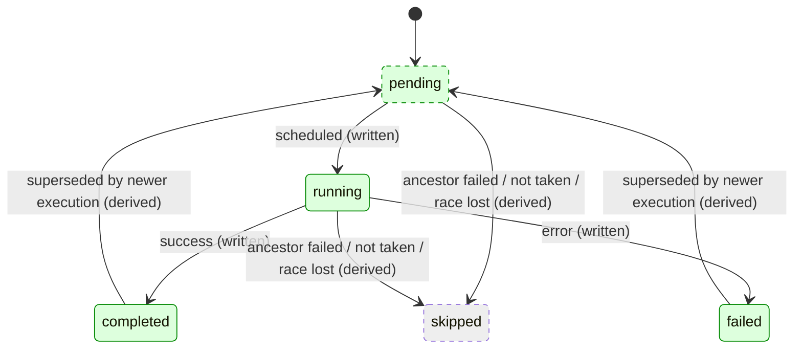

# pg_durable User Guide

**Durable SQL Functions for PostgreSQL**

pg_durable is a PostgreSQL extension that brings durable, fault-tolerant function execution directly into your database. Define durable SQL functions using a SQL-native DSL, and let the extension handle persistence, retries, and scheduling.

---

## Table of Contents

1. [Overview](#overview)
2. [Getting Started](#getting-started)
3. [Core Concepts](#core-concepts)
4. [DSL Reference](#dsl-reference)
5. [Condition Evaluation](#condition-evaluation)
6. [Function Examples](#function-examples)
7. [HTTP Requests](#http-requests)
8. [Multipart Uploads](#multipart-uploads)
9. [Durable Function Variables](#durable-function-variables)
10. [Loops & Cron Jobs](#loops--cron-jobs)
11. [Signals](#signals)
12. [Multi-Database Support](#multi-database-support)
13. [Visualizing Functions](#visualizing-functions)
14. [Monitoring](#monitoring)
15. [User Isolation & Privileges](#user-isolation--privileges)
16. [Connection Host](#connection-host)
17. [Connection Limits](#connection-limits)
18. [Troubleshooting](#troubleshooting)
19. [Quick Reference Card](#quick-reference-card)
20. [Appendix: Test Data Setup](#appendix-test-data-setup)

---

## Overview

### What is pg_durable?

pg_durable enables you to define and execute **durable SQL functions** entirely within PostgreSQL. Unlike traditional job queues or external workflow engines, pg_durable:

- **Lives in your database** - No external services to manage
- **Uses SQL syntax** - Define functions with familiar SQL operators
- **Is fault-tolerant** - Functions survive crashes and restarts
- **Supports scheduling** - Built-in cron-style scheduling for recurring jobs
- **Provides visibility** - Monitor function status directly via SQL queries

### Key Features

| Feature | Description |
|---------|-------------|
| **SQL DSL** | Define functions using plain SQL strings with intuitive operators |
| **Sequential Execution** | Chain steps with `~>` operator |
| **Parallel Execution** | Run steps concurrently with `&` operator or `df.join()` |
| **Race Execution** | First to complete wins with `\|` operator or `df.race()` |
| **Conditional Logic** | Branch with `?>` `!>` operators or `df.if()` |
| **Timers & Delays** | Sleep with `df.sleep()` |
| **Cron Scheduling** | Schedule with `df.wait_for_schedule()` |
| **Eternal Loops** | Create forever-running jobs with `@>` operator or `df.loop()` |
| **Signals** | Wait for external events with `df.wait_for_signal()` |
| **Variable Substitution** | Pass results between steps using `$name` |
| **Labels** | Tag functions with friendly names |
| **Visualization** | Preview function structure with `df.explain()` |
| **Monitoring** | Query function status, history, and metrics |

---

## Getting Started

### Prerequisites

pg_durable requires:
1. **An installed extension**: a Debian package, the Docker image, a source
   build, or `pgxn install pg_durable`. See
   [Packages](https://github.com/microsoft/pg_durable#packages) for the
   available channels and their prerequisites.
2. **PostgreSQL configuration**: Add `pg_durable` to `shared_preload_libraries` in `postgresql.conf`
3. **Server restart**: Required after modifying `shared_preload_libraries`
4. **Extension creation**: Run `CREATE EXTENSION pg_durable` in your database

### Enable the Extension

```sql
CREATE EXTENSION pg_durable;

-- Grant usage to application roles (superuser or delegated admin)
SELECT df.grant_usage('app_role');
```

After `CREATE EXTENSION`, the background worker initializes the engine schema asynchronously (normally within a few seconds). Until initialization completes, `df.*` functions will return: `"pg_durable background worker not yet initialized — try again in a moment"`. Simply retry after a short delay.

> ⚠️ **Important**: If you include `pg_durable` in `shared_preload_libraries` but don't create the extension, the worker will remain idle and durable functions cannot execute.

### Your First Durable Function

```sql
-- Execute a simple SQL query as a durable function
SELECT df.start('SELECT ''Hello, durable world!''');
-- Returns: a1b2c3d4 (8-character instance ID)
```

### Check the Result

```sql
-- List all functions
SELECT * FROM df.list_instances();

-- Get result of a specific instance
SELECT df.result('a1b2c3d4');
```

---

> 💡 **Want to run the examples?** The examples in this guide use a `playground` schema with sample data. See the [Appendix: Test Data Setup](#appendix-test-data-setup) to install it.

---

## Core Concepts

### Function Lifecycle

```
┌─────────────┐     ┌─────────────┐     ┌─────────────┐
│   Define    │ ──► │   Start     │ ──► │  Running    │
│  (DSL)      │     │  (returns   │     │  (bg work)  │
│             │     │   inst_id)  │     │             │
└─────────────┘     └─────────────┘     └──────┬──────┘
                                               │
                         ┌─────────────────────┼─────────────────────┐
                         ▼                     ▼                     ▼
                  ┌─────────────┐       ┌─────────────┐       ┌─────────────┐
                  │  Completed  │       │   Failed    │       │  Cancelled  │
                  └─────────────┘       └─────────────┘       └─────────────┘
```

### Instance IDs

Every durable function gets a unique 8-character hex ID (e.g., `a1b2c3d4`). Use this ID to:
- Check status: `SELECT df.status('a1b2c3d4')`
- Get result: `SELECT df.result('a1b2c3d4')`
- Cancel: `SELECT df.cancel('a1b2c3d4')`

### Durability

Functions are persisted to disk. If PostgreSQL crashes:
- Completed steps are not re-executed
- In-progress steps resume from the last checkpoint
- Pending steps execute when the server restarts

### Graph Construction

DSL functions build graph structures **in memory** without touching the database. Only when you call `df.start()` are the nodes written to the database:

```sql
-- This creates a JSON string representing the graph.
SELECT 'SELECT 1' ~> 'SELECT 2';
-- Returns: {"node_type":"THEN","left_node":{"node_type":"SQL","query":"SELECT 1"},"right_node":{"node_type":"SQL","query":"SELECT 2"}}

-- Only df.start() writes to the database
SELECT df.start('SELECT 1' ~> 'SELECT 2');
```

### Transaction Semantics

By default `df.start()` participates in the **caller's transaction**: the
instance and its graph are written via the caller's session, so if the caller's
transaction rolls back, the durable function is rolled back with it and never
runs.

The `transaction_mode` argument selects which transaction the *start itself*
runs in. It changes nothing about the durable function that gets started:

| `transaction_mode` | Behaviour |
|---|---|
| `'caller'` (default) | Joins the caller's transaction; a `ROLLBACK` discards the durable function. |
| `'new'` | Runs in its own transaction on a separate session; **survives a rollback of the caller's transaction**. |

The caller transaction may remain open for an arbitrary amount of time after
`df.start()` returns. The worker follows that transaction's outcome without
holding an execution connection: it begins the workflow after commit and
terminates the engine record without executing SQL after rollback. Rolling back
only the savepoint that contains `df.start()` is also treated as a rollback even
if the enclosing transaction later commits.

`'new'` provides the same rollback-survival outcome as Oracle autonomous
transactions and `REQUIRES_NEW` propagation for **asynchronously started work**.
It is not a synchronous autonomous routine: only the durable launch has
committed when `df.start()` returns. The workflow can still fail later, and
those errors are observed through `df.status()`, `df.result()`, and the
monitoring APIs rather than propagating through the original call.

Use it when the launch itself must survive a caller rollback and asynchronous
completion is acceptable. Do not use it for business invariants, per-row
trigger logging, or work that must complete before the caller can continue.

```sql
BEGIN;
    INSERT INTO employees (id, name) VALUES (999, 'Test User');

    -- Persists even though the surrounding transaction rolls back below.
    SELECT df.start(
        'INSERT INTO audit_log (message) VALUES (''Inserted employee 999'')',
        'audit',
        transaction_mode => 'new'
    );

    ROLLBACK;  -- employees insert is undone; the audit_log entry remains
```

An unrecognised `transaction_mode` raises an error rather than falling back to
the default, so a typo cannot silently produce a start that does not survive the
rollback you expected it to.

Under `'new'` the start runs under the calling role's identity and privileges,
just as `'caller'` does. Three consequences follow from the separate session:

- **Variables are the committed snapshot.** The captured `df.vars` snapshot
  contains only *committed* variables. A `df.setvar()` issued earlier in the
  caller's still-open transaction is invisible to it. Commit variables before
  calling, or pass values inline.
- **It costs an extra backend.** Each call opens (and closes) a PostgreSQL
  connection, so it counts against `max_connections`. pg_durable caps these
  extra loopback sessions cluster-wide with
  `pg_durable.max_new_transaction_starts` (default `2`); additional callers
  wait up to `pg_durable.new_transaction_start_timeout` seconds (default `5`)
  before failing without opening a second backend. Prefer the default on hot
  paths where transactional roll-up is acceptable. Avoid row triggers and other
  high-fan-out call sites unless you have explicitly validated the workload
  against that cap.
- **It is bounded, not unbounded.** The statement runs with a 30 s
  `lock_timeout`/`statement_timeout`. Without that bound, a caller holding a
  conflicting lock on a `df` table would wait forever — the separate session
  would block on the lock while the caller blocks on the socket, a cycle
  PostgreSQL's deadlock detector cannot see.
- **A returned ID confirms launch, not completion.** Keep the instance ID and
    monitor the workflow when delivery matters. Design the target operation to be
    idempotent because a connection failure can make the launch outcome uncertain.

`transaction_mode => 'new'` is rejected inside a workflow. A `df.sql()` node is
executed as a single statement on an autocommit connection, so a plain
`df.start()` there is already independent of any caller transaction; `'new'`
would buy nothing and consume an extra backend.

---

## DSL Reference

### Auto-Wrap SQL

Plain SQL strings are automatically wrapped - no need for explicit `df.sql()` calls:

```sql
-- These are equivalent:
'SELECT 1' ~> 'SELECT 2'
df.sql('SELECT 1') ~> df.sql('SELECT 2')
```

### Functions

| Function | Description | Example |
|----------|-------------|---------|
| `df.sleep(seconds)` | Pause for N seconds | `df.sleep(60)` |
| `df.wait_for_schedule(cron)` | Wait until cron matches | `df.wait_for_schedule('0 * * * *')` |
| `df.http(url, method, body, headers, timeout)` | Make HTTP request | `df.http('https://api.example.com', 'POST', '{"key": "value"}')` |
| `df.join(a, b)` | Execute in parallel, wait for all | `df.join('SELECT 1', 'SELECT 2')` |
| `df.join3(a, b, c)` | Three in parallel | `df.join3(a, b, c)` |
| `df.race(a, b)` | Execute in parallel, first wins | `df.race(fast_query, slow_query)` |
| `df.if(cond, then, else)` | Conditional branch | `df.if('SELECT true', a, b)` |
| `df.loop(body)` | Repeat forever | `df.loop(body)` |
| `df.loop(body, cond)` | Repeat while condition is true | `df.loop(body, 'SELECT count(*) > 0 FROM q')` |
| `df.break()` | Exit enclosing loop | `df.break()` |
| `df.break(value)` | Exit loop with **literal** return value (not auto-wrapped as SQL) | `df.break('{"done": true}')` |
| `df.start(func, label, database)` | Start function (optionally in another database) | `df.start('SELECT 1', 'job')` |
| `df.start(func, label, database, transaction_mode)` | Start function in its own transaction when `transaction_mode => 'new'` (survives caller rollback) | `df.start('INSERT INTO audit ...', 'audit', transaction_mode => 'new')` |
| `df.cancel(id, reason)` | Cancel function | `df.cancel('a1b2c3d4', 'Done')` |
| `df.status(id)` | Get status by instance_id (not label) | `df.status('a1b2c3d4')` |
| `df.result(id)` | Get result by instance_id (not label) | `df.result('a1b2c3d4')` |
| `df.explain(input)` | Visualize graph | `df.explain('a1b2c3d4')` |
| `df.setvar(name, value)` | Set durable function variable | `df.setvar('api_url', 'https://...')` |
| `df.getvar(name)` | Get durable function variable | `df.getvar('api_url')` |
| `df.unsetvar(name)` | Remove durable function variable | `df.unsetvar('api_url')` |
| `df.clearvars()` | Clear all durable function variables | `df.clearvars()` |
| `df.wait_for_signal(name)` | Wait for external signal | `df.wait_for_signal('approval')` |
| `df.wait_for_signal(name, timeout)` | Wait with timeout (seconds) | `df.wait_for_signal('approval', 3600)` |
| `df.signal(id, name, data)` | Send signal to instance | `df.signal('a1b2', 'go', '{}')` |
| `df.await_instance(id)` | Block until instance completes (default 30s timeout) | `df.await_instance('a1b2c3d4')` |
| `df.await_instance(id, timeout)` | Block until instance completes with explicit timeout in seconds | `df.await_instance('a1b2c3d4', 60)` |

### Operators

| Operator | Name | Description | Example |
|----------|------|-------------|---------|
| `~>` | Sequence | Run left, then right | `'SELECT 1' ~> 'SELECT 2'` |
| `\|=>` | Name | Name result for later use | `'SELECT 1' \|=> 'myvar'` |
| `&` | Join | Run in parallel, wait for all | `'SELECT 1' & 'SELECT 2'` |
| `\|` | Race | Run in parallel, first wins | `fast_query \| slow_query` |
| `?>` | If-Then | Conditional then branch | `cond ?> then_branch` |
| `!>` | Else | Conditional else branch | `cond ?> then !> else` |
| `@>` | Loop | Repeat forever (prefix) | `@> body` |

### Operator Examples

```sql
-- Join: run both in parallel, wait for all
SELECT df.start('SELECT 1' & 'SELECT 2');

-- Race: run both, first to complete wins
SELECT df.start(
    'SELECT quick_result()' | df.sleep(30)  -- timeout after 30s
);

-- If-then-else with operators
SELECT df.start(
    'SELECT count(*) > 10 FROM orders' 
        ?> 'SELECT ''high volume'''
        !> 'SELECT ''low volume'''
);

-- Loop with operator (prefix)
SELECT df.start(
    @> ('INSERT INTO heartbeats (ts) VALUES (now())' ~> df.sleep(60)),
    'heartbeat-job'
);
```

### Graph Depth

A workflow graph can contain at most 256 nested composition levels. `df.start()` and
`df.explain()` reject deeper graphs with a maximum-nesting-depth error. Split a larger workflow
into smaller sub-workflows when it would exceed this limit.

### Variable Substitution

Use `$name` to reference named results in subsequent steps:

```sql
SELECT df.start(
    'SELECT 100 as amount' |=> 'total'        -- save result as $total
    ~> 'SELECT $total * 2 as doubled'         -- use $total in next step
);
```

#### Dot-Notation (`$name.column`)

Access specific columns by name instead of just the first column:

```sql
SELECT df.start(
    $$SELECT 42 AS id, 'Alice' AS name$$ |=> 'user'
    ~> $$SELECT $user.id AS id, $user.name AS name$$  -- access specific columns
);
```

#### Null-Safe Accessor (`$name?`, `$name.column?`)

By default, referencing a result with no rows or a NULL value **fails** the instance with a clear error. Use the `?` suffix to substitute `NULL` instead:

```sql
SELECT df.start(
    $$SELECT NULL::text AS val$$ |=> 'x'
    ~> $$SELECT COALESCE($x.val?, 'fallback')$$   -- NULL → 'fallback'
);
```

| Pattern | No rows | NULL value |
|---------|---------|------------|
| `$name` | **Fails** | **Fails** |
| `$name.col` | **Fails** | **Fails** |
| `$name?` | → `NULL` | → `NULL` |
| `$name.col?` | → `NULL` | → `NULL` |

#### Row-Set Expansion (`$name.*`)

Expand a multi-row result into an inline `VALUES` subquery:

```sql
SELECT df.start(
    $$SELECT id, name FROM users WHERE active$$ |=> 'batch'
    ~> $$SELECT count(*) FROM $batch.*$$                   -- FROM expansion
);
```

This is useful for passing row sets between steps. The expansion generates SQL like `(VALUES (1,'Alice'), (2,'Bob')) AS batch(id, name)`.

### Result Format

When a SQL node completes, its result is stored as a JSON object with this shape:

```json
{
  "rows": [
    {"column1": "value1", "column2": 42},
    {"column1": "value2", "column2": 99}
  ],
  "row_count": 2
}
```

| Field | Type | Description |
|-------|------|-------------|
| `rows` | Array of objects | Each element is one row; keys are column names |
| `row_count` | Integer | Number of rows returned |

When accessing results via `df.result(id)`, you get this JSON text. Use PostgreSQL's JSON operators to extract values:

```sql
-- Get the result
SELECT df.result('a1b2c3d4');
-- Returns: '{"rows":[{"answer":42}],"row_count":1}'

-- Extract a specific value
SELECT df.result('a1b2c3d4')::jsonb->'rows'->0->>'answer';
-- Returns: '42'
```

**Special cases:**
- A SQL query returning no rows produces: `{"rows": [], "row_count": 0}`
- `df.sleep()` returns a top-level JSON object like `{"slept": true, "seconds": 60}`
- `df.wait_for_schedule()` returns a top-level JSON object: `{"scheduled": true}`
- `df.http()` and `df.http_multipart()` return a top-level JSON object with `status`, `body`, `encoding`, `headers`, `ok`, and `duration_ms` fields
- `df.break('value')` stores the literal value as the loop result (not wrapped in `rows`)


### Cron Expression Format

```
┌───────────── minute (0-59)
│ ┌───────────── hour (0-23)
│ │ ┌───────────── day of month (1-31)
│ │ │ ┌───────────── month (1-12)
│ │ │ │ ┌───────────── day of week (0-6, Sun=0)
│ │ │ │ │
* * * * *
```

| Expression | Description |
|------------|-------------|
| `* * * * *` | Every minute |
| `*/5 * * * *` | Every 5 minutes |
| `0 * * * *` | Every hour (at :00) |
| `0 0 * * *` | Daily at midnight |
| `0 9 * * 1-5` | Weekdays at 9am |
| `0 0 1 * *` | First of each month |

---

## Condition Evaluation

When using conditional operators (`?>`, `!>`), `df.if()`, or loop conditions (`df.loop(body, condition)`), pg_durable needs to interpret SQL results as boolean values. This section explains how arbitrary data types are evaluated for truthiness.

### How SQL Results Are Evaluated

When a condition SQL query executes, pg_durable:

1. **Extracts the first column of the first row** from the result
2. **Evaluates that value for truthiness** using the rules below

```sql
-- Example: condition evaluates the first column of first row
SELECT df.start(
    'SELECT count(*) > 10 FROM orders'   -- Returns: true or false
        ?> 'SELECT ''high volume'''
        !> 'SELECT ''low volume'''
);
```

### Truthiness Rules by Type

| Type | Truthy | Falsy |
|------|--------|-------|
| **Boolean** | `true`, `t` | `false`, `f` |
| **Number** | Any non-zero value | `0`, `0.0` |
| **String** | `'true'`, `'t'`, `'yes'`, `'1'`, any non-empty string | `'false'`, `'f'`, `'no'`, `'0'`, empty string `''` |
| **Array/JSON Array** | Non-empty array `[1,2,3]` | Empty array `[]` |
| **Object/JSON Object** | Non-empty object `{"a":1}` | Empty object `{}` |
| **NULL** | — | Always falsy |

### Examples

```sql
-- Boolean expressions (most common)
'SELECT true'                              -- ✓ truthy
'SELECT false'                             -- ✗ falsy
'SELECT count(*) > 0 FROM users'           -- ✓ truthy if count > 0
'SELECT EXISTS(SELECT 1 FROM orders)'      -- ✓ truthy if exists

-- Numeric comparisons
'SELECT 1'                                 -- ✓ truthy (non-zero)
'SELECT 0'                                 -- ✗ falsy (zero)
'SELECT count(*) FROM empty_table'         -- ✗ falsy (returns 0)

-- String conditions
'SELECT ''yes'''                           -- ✓ truthy
'SELECT ''no'''                            -- ✗ falsy
'SELECT status FROM orders WHERE id = 1'   -- ✓ truthy if non-empty string

-- NULL handling
'SELECT NULL'                              -- ✗ falsy
'SELECT name FROM users WHERE id = 999'    -- ✗ falsy if no rows (NULL)
```

### Best Practices

1. **Use explicit boolean expressions** for clarity:

```sql
-- Good: explicit boolean
'SELECT count(*) > 0 FROM pending_tasks'

-- Works but less clear: relies on numeric truthiness
'SELECT count(*) FROM pending_tasks'
```

2. **Handle NULL explicitly** when querying data that might not exist:

```sql
-- Good: COALESCE ensures a boolean result
'SELECT COALESCE(active, false) FROM users WHERE id = $user_id'

-- Risky: NULL if user doesn't exist
'SELECT active FROM users WHERE id = $user_id'
```

3. **Use EXISTS for existence checks**:

```sql
-- Good: EXISTS always returns true/false
'SELECT EXISTS(SELECT 1 FROM orders WHERE status = ''pending'')'

-- Works but returns count instead of boolean
'SELECT count(*) > 0 FROM orders WHERE status = ''pending'''
```

### Loop Condition Example

For `df.loop(body, condition)`, the condition is evaluated after each iteration:

```sql
-- Loop while there are pending items
SELECT df.start(
    df.loop(
        'SELECT process_next_item()',
        'SELECT count(*) > 0 FROM queue WHERE status = ''pending'''  -- condition
    )
);
```

The loop continues while the condition is truthy and exits when it becomes falsy.

---

## Function Examples

### 1. Simple Query

```sql
SELECT df.start(
    'SELECT COUNT(*) FROM playground.users WHERE active = true',
    'count-active-users'
);
```

### 2. Sequential Steps

```sql
SELECT df.start(
    'INSERT INTO playground.logs (msg) VALUES (''Step 1: Starting'')'
    ~> 'INSERT INTO playground.logs (msg) VALUES (''Step 2: Processing'')'
    ~> 'INSERT INTO playground.logs (msg) VALUES (''Step 3: Complete'')',
    'three-step-function'
);
```

### 3. Multi-Step ETL

```sql
SELECT df.start(
    'DELETE FROM playground.target 
     WHERE loaded_at < now() - interval ''1 day'''                    -- cleanup
    ~> 'UPDATE playground.staging 
        SET processed_at = now() WHERE processed_at IS NULL'          -- mark
    ~> 'INSERT INTO playground.target (data, source_id, processed_at) 
        SELECT data, source_id, processed_at FROM playground.staging 
        WHERE processed_at IS NOT NULL',                              -- load
    'daily-etl'
);
```

### 4. With Variables

```sql
SELECT df.start(
    'SELECT id FROM playground.orders 
     WHERE status = ''pending'' LIMIT 1' |=> 'order_id'               -- get order
    ~> 'UPDATE playground.orders 
        SET status = ''processing'' WHERE id = $order_id'             -- mark processing
    ~> df.sleep(2)                                               -- simulate work
    ~> 'UPDATE playground.orders 
        SET status = ''completed'', processed_at = now() 
        WHERE id = $order_id',                                        -- complete
    'process-order'
);
```

### 5. Parallel Execution

```sql
-- Using & operator (preferred)
SELECT df.start(
    'SELECT COUNT(*) as user_count FROM playground.users'             -- branch 1
    & 'SELECT COUNT(*) as order_count FROM playground.orders'         -- branch 2
    ~> 'INSERT INTO playground.logs (msg) 
        VALUES (''Parallel counts complete'')',
    'parallel-counts'
);

-- Or using df.join() function
SELECT df.start(
    df.join(
        'SELECT COUNT(*) as user_count FROM playground.users',
        'SELECT COUNT(*) as order_count FROM playground.orders'
    )
    ~> 'INSERT INTO playground.logs (msg) VALUES (''Done'')',
    'parallel-counts-func'
);
```

### 6. Conditional Logic

```sql
-- Using ?> !> operators (preferred)
SELECT df.start(
    'SELECT COUNT(*) > 3 FROM playground.task_queue WHERE status = ''pending'''
        ?> 'INSERT INTO playground.logs (msg, level) VALUES (''High load!'', ''warning'')'
        !> 'INSERT INTO playground.logs (msg) VALUES (''Queue normal'')',
    'check-task-load'
);

-- Or using df.if() function
SELECT df.start(
    df.if(
        'SELECT COUNT(*) > 3 FROM playground.task_queue WHERE status = ''pending''',
        'INSERT INTO playground.logs (msg, level) VALUES (''High load!'', ''warning'')',
        'INSERT INTO playground.logs (msg) VALUES (''Queue normal'')'
    ),
    'check-task-load-func'
);
```

#### Branching on Row Count with `df.if_rows`

Use `df.if_rows()` to branch based on whether a named result has rows — without executing an extra SQL query:

```sql
SELECT df.start(
    $$SELECT id FROM playground.orders WHERE status = 'pending'$$ |=> 'pending'
    ~> df.if_rows(
        'pending',                                               -- result name
        $$UPDATE playground.orders SET status = 'processing' WHERE id = $pending.id$$,  -- then
        $$INSERT INTO playground.logs (msg) VALUES ('No pending orders')$$               -- else
    ),
    'check-pending'
);
```

### 7. Task Queue Processor

```sql
SELECT df.start(
    'UPDATE playground.task_queue 
     SET status = ''processing'', started_at = now()
     WHERE id = (
         SELECT id FROM playground.task_queue 
         WHERE status = ''pending'' 
         ORDER BY priority DESC, created_at 
         LIMIT 1 
         FOR UPDATE SKIP LOCKED
     )
     RETURNING id, payload' |=> 'task'                                -- claim task
    ~> df.sleep(1)                                               -- process
    ~> 'UPDATE playground.task_queue 
        SET status = ''completed'', completed_at = now()
        WHERE status = ''processing''',                               -- complete
    'process-next-task'
);
```

---

## HTTP Requests

Use `df.http()` to make HTTP requests to external APIs, webhooks, or services. HTTP requests are executed as durable activities - they survive crashes and can be retried.

### df.http() Function

```sql
df.http(
    url TEXT,                     -- Required: endpoint URL
    method TEXT DEFAULT 'POST',   -- GET, POST, PUT, DELETE, PATCH
    body TEXT DEFAULT NULL,       -- Request body (JSON)
    headers JSONB DEFAULT '{}',   -- Custom headers
    timeout_seconds INT DEFAULT 30,
    options JSONB DEFAULT NULL    -- Reserved; only NULL or '{}' is accepted
) RETURNS TEXT                    -- JSON response object
```

`options` is the extension point for future request modifiers. No option key is
supported in this version: passing an object with any key, or a JSON value that
is not an object, raises an error.

### Response Format

HTTP calls return a JSON object with full response details:

```json
{
  "status": 200,
  "body": "{\"result\": \"success\"}",
  "encoding": "text",
  "headers": {"content-type": "application/json"},
  "ok": true,
  "duration_ms": 245
}
```

| Field | Description |
|-------|-------------|
| `status` | HTTP status code (200, 404, 500, etc.) |
| `body` | Response body (see `encoding`) |
| `encoding` | `text` if the body is the response as-is, `base64` if it is binary |
| `headers` | Response headers object |
| `ok` | `true` for 2xx status codes |
| `duration_ms` | Request duration in milliseconds |

### Reading Response Fields

Address envelope fields directly with dot notation:

```sql
df.http('https://api.example.com/users/123', 'GET') |=> 'user'
~> 'INSERT INTO users_cache (data) VALUES (($user.body)::jsonb)'
```

`$user.body`, `$user.status`, `$user.ok`, and `$user.encoding` all resolve. Inside a SQL
node the value is quoted and escaped appropriately for its type, so `$user.ok` becomes a
bare `true`/`false` and `$user.body` becomes a properly quoted string literal.

Use `$user.field?` for a null-safe read that yields `NULL` instead of failing when the
field is absent.

### Binary Responses

When a response is not textual — an image, a PDF, an audio file — the body cannot be stored
verbatim in a JSON envelope. pg_durable base64-encodes it and sets `"encoding": "base64"`:

```json
{"status": 200, "body": "SUQzBAAAAAAA…", "encoding": "base64", "ok": true}
```

A body is treated as text when the `Content-Type` is missing, `text/*`, a `+json` / `+xml`
/ `+yaml` type, or one of the common application types (`application/json`,
`application/xml`, `application/yaml`, `application/x-www-form-urlencoded`, and friends).
Everything else is base64.

To store the raw bytes, decode on the way in:

```sql
df.http('https://api.example.com/report.pdf', 'GET') |=> 'pdf'
~> 'INSERT INTO documents (body) VALUES (decode($pdf.body, ''base64''))'
```

Because the body is *already* base64, it can be handed straight to a multipart upload with
no round trip through a table — see [Multipart Uploads](#multipart-uploads).

### Error Handling

- **2xx responses**: Success - `ok` is `true`
- **4xx responses**: Returned to user (not a failure) - handle in workflow
- **5xx responses**: Activity fails and may be retried
- **Timeouts/Network errors**: Activity fails and may be retried

### HTTP Examples

#### 1. Simple GET Request

```sql
SELECT df.start(
    df.http('https://api.example.com/users/123', 'GET') |=> 'user'
    ~> 'INSERT INTO users_cache (data) VALUES (($user.body)::jsonb)',
    'fetch-user'
);
```

#### 2. POST with JSON Body

```sql
SELECT df.start(
    df.http(
        'https://api.example.com/orders',
        'POST',
        '{"product_id": 42, "quantity": 2}'
    ) |=> 'response'
    ~> df.if(
        'SELECT $response.ok',
        'INSERT INTO playground.logs (msg) VALUES (''Order created'')',
        'INSERT INTO playground.logs (msg, level) VALUES (''Order failed'', ''error'')'
    ),
    'create-order'
);
```

#### 3. HTTP with Custom Headers

```sql
SELECT df.start(
    df.http(
        'https://api.example.com/secure/data',
        'GET',
        NULL,
        '{"Authorization": "Bearer token123", "X-Custom-Header": "value"}'::jsonb
    ) |=> 'response'
    ~> 'SELECT ($response::jsonb->>''body'')::jsonb',
    'authenticated-request'
);
```

#### 4. Parallel API Calls

```sql
SELECT df.start(
    df.join(
        df.http('https://api.example.com/users', 'GET'),
        df.http('https://api.example.com/products', 'GET')
    ) |=> 'results'
    ~> 'INSERT INTO playground.logs (msg) VALUES (''Fetched users and products'')',
    'parallel-fetch'
);
```

#### 5. HTTP with Variable Substitution

```sql
SELECT df.start(
    'SELECT id, email FROM playground.users WHERE id = 1' |=> 'user'
    ~> df.http(
        'https://api.example.com/notifications',
        'POST',
        '{"user_id": "$user.id", "message": "Welcome!"}'
    ) |=> 'notification'
    ~> 'UPDATE playground.users SET notified = true WHERE id = $user.id',
    'send-notification'
);
```

#### 6. Handle 4xx Errors in Workflow

```sql
SELECT df.start(
    df.http('https://api.example.com/users/999', 'GET') |=> 'response'
    ~> df.if(
        'SELECT $response.status = 404',
        'INSERT INTO playground.logs (msg) VALUES (''User not found - creating new'')'
            ~> df.http('https://api.example.com/users', 'POST', '{"name": "New User"}'),
        'SELECT ($response.body)::jsonb'
    ),
    'fetch-or-create-user'
);
```

#### 7. Webhook Integration

```sql
SELECT df.start(
    'SELECT order_id, status, total FROM playground.orders WHERE id = 1' |=> 'order'
    ~> df.http(
        'https://partner.example.com/webhook/order-update',
        'POST',
        '{"order_id": "$order.order_id", "status": "$order.status", "total": "$order.total"}',
        '{"X-Webhook-Secret": "shared-secret-123"}'::jsonb
    ) |=> 'webhook_response'
    ~> 'INSERT INTO playground.logs (msg) VALUES (''Webhook sent: '' || $webhook_response.status)',
    'send-order-webhook'
);
```

#### 8. Scheduled API Polling

```sql
SELECT df.start(
    @> (
        df.wait_for_schedule('*/5 * * * *')  -- Every 5 minutes
        ~> df.http('https://api.example.com/status', 'GET') |=> 'status'
        ~> df.if(
            'SELECT (($status::jsonb->>''body'')::jsonb->>''healthy'')::boolean = false',
            'INSERT INTO playground.logs (msg, level) VALUES (''Service unhealthy!'', ''error'')',
            'SELECT ''healthy'''
        )
    ),
    'api-health-monitor'
);
```

#### 9. Real-World Example: Scheduled GitHub Commit Sync

This example creates a scheduled durable function that fetches the last 5 commits from a GitHub repository every 30 minutes and stores them in a table. It demonstrates variables, HTTP requests, parsing complex JSON, and scheduled loops.

```sql
-- Create table to store commit data (sha, author, message, time)
CREATE TABLE IF NOT EXISTS github_commits (
    id SERIAL PRIMARY KEY,
    sha TEXT UNIQUE,
    author TEXT,
    message TEXT,
    committed_at TIMESTAMPTZ,
    fetched_at TIMESTAMPTZ DEFAULT now()
);

-- Configure the sync URL using durable function variable
SELECT df.setvar('github_url', 'https://api.github.com/repos/microsoft/duroxide/commits?per_page=5');

-- Start scheduled commit sync (runs every 30 minutes)
SELECT df.start(
    @> (
        (df.http(
            '{github_url}',
            'GET',
            NULL,
            '{"Accept": "application/vnd.github.v3+json", "User-Agent": "pg_durable"}'::jsonb
        ) |=> 'response')
        ~> 'INSERT INTO github_commits (sha, author, message, committed_at)
            SELECT 
                c->>''sha'',
                c->''commit''->''author''->>''name'',
                c->''commit''->>''message'',
                (c->''commit''->''author''->>''date'')::timestamptz
            FROM jsonb_array_elements(($response::jsonb->>''body'')::jsonb) AS c
            ON CONFLICT (sha) DO UPDATE SET
                fetched_at = now()
            RETURNING sha'
        ~> df.wait_for_schedule('*/30 * * * *')  -- Every 30 minutes
    ),
    'github-commit-sync'
);

-- Check the results
SELECT sha, author, committed_at, LEFT(message, 50) AS message FROM github_commits;

-- To stop the sync:
-- SELECT df.cancel('<instance_id>', 'Stopping commit sync');
```

This demonstrates:
- Configuring API endpoints with durable function variables
- Calling a real REST API (GitHub)
- Setting required headers (User-Agent, Accept)
- Parsing nested JSON (extracting `commit.author.name` and `commit.message`)
- Upserting with ON CONFLICT
- Creating a scheduled loop that runs every 30 minutes

---

## Multipart Uploads

`df.http_multipart()` sends a `multipart/form-data` request — the format file uploads use.
It needs the same `include_http => true` grant as `df.http()`.

```sql
df.http_multipart(
    url TEXT,                     -- Required: endpoint URL
    method TEXT DEFAULT 'POST',
    parts JSONB DEFAULT '[]',     -- Array of part objects
    headers JSONB DEFAULT '{}',
    timeout_seconds INT DEFAULT 30,
    options JSONB DEFAULT NULL    -- Reserved; only NULL or '{}' is accepted
) RETURNS TEXT                    -- Same JSON envelope as df.http()
```

Each part is an object with `name` and `data_b64`, optionally `filename` (which makes it a
file upload) and `content_type`:

```sql
SELECT df.start(
    'SELECT id, doc FROM invoices WHERE id = 1' |=> 'inv'
    ~> df.http_multipart(
        'https://api.example.com/upload', 'POST',
        jsonb_build_array(
            jsonb_build_object(
                'name', 'file',
                'filename', 'invoice.pdf',
                'content_type', 'application/pdf',
                'data_b64', (SELECT encode(doc, 'base64') FROM invoices WHERE id = 1))),
        '{"Authorization": "Bearer token"}'::jsonb
    ) |=> 'upload'
    ~> 'UPDATE invoices SET uploaded = $upload.ok WHERE id = $inv.id',
    'upload-invoice'
);
```

`encode(bytea, 'base64')` wraps its output at 76 columns. That is accepted as-is — no
`replace(..., E'\n', '')` needed.

### Chaining a Download into an Upload

Because a binary response body is already base64, it can be passed straight into a part.
No table, no temporary storage:

```sql
SELECT df.start(
    df.http('https://api.example.com/render.pdf', 'GET') |=> 'pdf'
    ~> df.http_multipart(
        'https://api.example.com/archive', 'POST',
        jsonb_build_array(
            jsonb_build_object(
                'name', 'file', 'filename', 'render.pdf',
                'content_type', 'application/pdf',
                'data_b64', '$pdf.body'))
    ) |=> 'archived'
    ~> 'INSERT INTO archive_log (ok) VALUES ($archived.ok)',
    'fetch-and-archive'
);
```

### data_b64 Is Whole-Value Only

A variable reference in `data_b64` must be the *entire* value:

```sql
'data_b64', '$pdf.body'        -- ✅
'data_b64', '{my_payload}'     -- ✅
'data_b64', 'prefix$pdf.body'  -- ❌ node fails
```

Splicing a value into the middle of a base64 string cannot produce valid base64, so
pg_durable fails the node with a clear message instead of uploading a corrupt part. Every
other field — `url`, `name`, `filename`, headers — interpolates normally.

For a complete worked example, see
[examples/audio-roundtrip/](examples/audio-roundtrip/), which sends text to a
text-to-speech API and pipes the returned MP3 directly into a transcription upload.

---

## Durable Function Variables

Durable function variables allow you to configure durable functions with external values like API endpoints, credentials, or configuration settings. Variables are set **before** starting a durable function and remain **immutable** during execution.

### How Variables Work

1. **Set variables** using `df.setvar()` before calling `df.start()`
2. Variables are **captured** when `df.start()` is called
3. Variables are **immutable** during durable function execution
4. Use `{varname}` syntax in SQL to substitute variable values

### Variable Functions

| Function | Description |
|----------|-------------|
| `df.setvar(name, value)` | Set a variable (before durable function starts) |
| `df.getvar(name)` | Get a variable value |
| `df.unsetvar(name)` | Remove a variable |
| `df.clearvars()` | Clear all variables |

> **Important**: `df.setvar()`, `df.unsetvar()`, and `df.clearvars()` cannot be called from within a running durable function. They are for configuration only.

> **Variables are not secrets.** `df.vars` stores values as plaintext, and the value is copied
> into durable execution history when `df.start()` runs. See
> [Variables and secrets](#variables-and-secrets) before putting a credential in one.

### System Variables

These read-only variables are automatically available during durable function execution:

| Variable | Description |
|----------|-------------|
| `{sys_instance_id}` | Current durable function instance ID |
| `{sys_label}` | Durable function label (if provided) |

### Variables and secrets

Using `df.setvar()` to hold an API key is a natural move, and it genuinely helps — but only in
one place. Here is exactly what it does and does not protect, so you can make an informed
choice.

Given this pattern:

```sql
SELECT df.setvar('api_key', '<credential>');
SELECT df.start(df.http('https://api.example.com/users', 'GET', NULL,
                        '{"Authorization": "Bearer {api_key}"}'::jsonb), 'fetch-users');
```

| Location | Holds the credential? | Notes |
|----------|----------------------|-------|
| `df.nodes.query` | No — stores the literal `{api_key}` | This is the one thing `{var}` genuinely buys you. Substitution happens at execution time, not when the node is created. |
| `df.vars.value` | **Yes, plaintext** | RLS isolates it from other users. It is *not* encrypted, and it is not hidden from a superuser or the table owner. |
| Durable execution history | **Yes, plaintext** | `df.start()` snapshots every variable you own into the orchestration input, and the substituted header is recorded as the HTTP step's input. Parallel branches and each loop iteration re-record it. |
| WAL, backups, replicas | **Yes** | Follows every write above, typically with a longer retention than `pg_durable.retention_days`. |
| Server log | URLs are redacted; SQL text depends on `pg_durable.log_workflow_sql` | See [What reaches the server log](#what-reaches-the-server-log). |
| `pg_stat_activity`, `pg_stat_statements` | Only if you inline the literal | `SELECT df.setvar('api_key', '<credential>')` is itself a statement. Bind it as a parameter, or use `\getenv` in psql, rather than typing the value into SQL. |

Writing the credential directly into `df.http(...)` instead of using a variable is strictly
worse: it adds `df.nodes.query` to that list without removing anything from it.

Practical guidance:

- Prefer credentials that are short-lived and narrowly scoped, so history exposure is bounded.
- Treat `df.vars` as configuration — hostnames, table names, batch sizes, API versions.
- Treat a database backup as containing every credential any workflow has used.
- Set `pg_durable.retention_days` to the shortest value your operations allow.

### Variable Substitution

> **Security note**: All `{...}` substitutions — including `{varname}`, `{sys_label}`, and `{sys_instance_id}` — perform **raw text substitution**. The value is inserted directly into the SQL string without escaping or parameterization. This is by design so that variables can hold SQL fragments like table names or expressions. Since you control both the variable value and the query template, and SQL executes under your own role, this is safe for configuration values you set yourself. Do **not** store untrusted external input in variables that get substituted into SQL. For passing query *results* between steps, use `$name` (via `|=>`), which applies proper SQL escaping.

Use `{varname}` in SQL queries to substitute variable values:

```sql
-- Set up configuration
SELECT df.setvar('api_base', 'https://api.example.com');
SELECT df.setvar('page_size', '50');

-- Start durable function using variables
SELECT df.start(
    df.http('{api_base}/users?per_page={page_size}', 'GET')
    ~> 'INSERT INTO playground.logs (msg) VALUES (''Fetched users'')',
    'fetch-users'
);
```

### Example: Configurable ETL Pipeline

```sql
-- Configure the pipeline
SELECT df.setvar('source_table', 'raw_orders');
SELECT df.setvar('target_table', 'processed_orders');
SELECT df.setvar('batch_size', '100');

-- Start the pipeline
SELECT df.start(
    'SELECT * FROM {source_table} LIMIT {batch_size}::int' |=> 'batch'
    ~> 'INSERT INTO {target_table} SELECT * FROM $batch.*',
    'etl-pipeline'
);
```

### Example: Using System Variables for Logging

```sql
SELECT df.start(
    'INSERT INTO audit_log (instance_id, label, action, ts) 
     VALUES (''{sys_instance_id}'', ''{sys_label}'', ''started'', now())'
    ~> 'SELECT process_data()'
    ~> 'INSERT INTO audit_log (instance_id, label, action, ts) 
        VALUES (''{sys_instance_id}'', ''{sys_label}'', ''completed'', now())',
    'audit-example'
);
```

### Example: HTTP with Variables

```sql
-- Configure API endpoint
SELECT df.setvar('webhook_url', 'https://hooks.example.com/notify');

-- Durable function that calls the configured webhook
SELECT df.start(
    'SELECT id, status FROM orders WHERE id = 1' |=> 'order'
    ~> df.http('{webhook_url}', 'POST', '{"order_id": "$order"}'),
    'order-webhook'
);
```

### Variable Lifecycle

```
┌─────────────────────────────────────────────────────────────┐
│  User Session                                               │
│  ┌─────────────────────────────────────────────────────┐    │
│  │ df.setvar('key', 'value')  ← Configure variables    │    │
│  │ df.setvar('url', 'https://...')                     │    │
│  └─────────────────────────────────────────────────────┘    │
│                           │                                 │
│                           ▼                                 │
│  ┌─────────────────────────────────────────────────────┐    │
│  │ df.start(workflow, 'label')                         │    │
│  │   → Variables CAPTURED (snapshot taken)             │    │
│  │   → Variables become IMMUTABLE for this execution   │    │
│  └─────────────────────────────────────────────────────┘    │
└─────────────────────────────────────────────────────────────┘
                           │
                           ▼
┌─────────────────────────────────────────────────────────────┐
│  Background Worker (Durable Function Execution)             │
│  ┌─────────────────────────────────────────────────────┐    │
│  │ {key} → 'value'         ← Substitution works        │    │
│  │ {url} → 'https://...'                               │    │
│  │ {sys_instance_id} → 'a1b2c3d4'                      │    │
│  │                                                     │    │
│  │ df.setvar('x', 'y')     ← ERROR! Cannot modify      │    │
│  └─────────────────────────────────────────────────────┘    │
└─────────────────────────────────────────────────────────────┘
```

---

## Loops & Cron Jobs

### Eternal Loops

Use `@>` operator or `df.loop()` to create functions that run forever. Each iteration creates a new execution with fresh state (via continue-as-new).

```sql
-- Simple heartbeat every 30 seconds (using @> operator)
SELECT df.start(
    @> ('INSERT INTO playground.heartbeats (ts) VALUES (now())' ~> df.sleep(30)),
    'heartbeat-30s'
);

-- Same using df.loop() function
SELECT df.start(
    df.loop(
        'INSERT INTO playground.heartbeats (ts) VALUES (now())' ~> df.sleep(30)
    ),
    'heartbeat-30s-func'
);
```

### Cron-Style Scheduling

Use `df.wait_for_schedule()` with a cron expression:

```sql
-- Every minute: log a tick
SELECT df.start(
    @> (
        df.wait_for_schedule('* * * * *')
        ~> 'INSERT INTO playground.logs (msg) VALUES (''Minute tick: '' || now()::text)'
    ),
    'every-minute-tick'
);

-- Every 5 minutes: check for pending tasks
SELECT df.start(
    @> (
        df.wait_for_schedule('*/5 * * * *')
        ~> 'SELECT COUNT(*) as pending FROM playground.task_queue 
            WHERE status = ''pending''' |=> 'count'
        ~> 'INSERT INTO playground.logs (msg) VALUES (''Pending tasks: '' || $count)'
    ),
    'task-monitor-5min'
);

-- Hourly: clean up old logs
SELECT df.start(
    @> (
        df.wait_for_schedule('0 * * * *')
        ~> 'DELETE FROM playground.logs 
            WHERE created_at < now() - interval ''24 hours'''
    ),
    'hourly-log-cleanup'
);

-- Daily at midnight: archive completed orders
SELECT df.start(
    @> (
        df.wait_for_schedule('0 0 * * *')
        ~> 'UPDATE playground.orders SET status = ''archived'' 
            WHERE status = ''completed'' 
            AND processed_at < now() - interval ''7 days'''
    ),
    'daily-order-archive'
);

-- Weekdays at 9am: generate report
SELECT df.start(
    @> (
        df.wait_for_schedule('0 9 * * 1-5')
        ~> 'SELECT playground.generate_report(''daily_summary'')'
    ),
    'weekday-morning-report'
);
```

### While Loops

Use `df.loop(body, condition)` to repeat while a condition is true:

```sql
-- Process items while queue has entries
SELECT df.start(
    df.loop(
        'SELECT process_next_item()' ~> df.sleep(1),
        'SELECT count(*) > 0 FROM task_queue WHERE status = ''pending'''
    ),
    'queue-processor'
);
```

### Breaking Out of Loops

Use `df.break()` to exit a loop from inside its body:

```sql
-- Process batches until done flag is set
SELECT df.start(
    df.loop(
        'SELECT process_batch()' |=> 'batch'
        ~> (
            '$batch.done'
                ?> df.break('{"status": "complete", "total": $batch.count}')
                !> df.sleep(5)
        )
    ),
    'batch-processor'
);
```

`df.break(value)` exits the loop and returns `value` as the loop's final result.

> **Note:** Unlike most DSL functions, `df.break()` does **not** auto-wrap its argument as SQL. The string you pass is returned verbatim as a literal value (typically JSON or text). To break with the result of a SQL query, run the query first and reference the result via variable substitution:
>
> ```sql
> df.loop(
>     'SELECT summary FROM report' |=> 'r'
>     ~> df.break('$r.summary')
> )
> ```

### How Loops Execute

Each loop iteration advances via *continue-as-new*, which restarts the loop with fresh state while preserving durability. Where that restart happens depends on whether the loop is the **root** of the function:

- A **root loop** (the function graph's outermost node, e.g. `df.start(df.loop(...))` or `df.start(@> 'SELECT work()')`) runs inline on the function's own orchestration. There is no surrounding work to preserve, so each iteration simply restarts the function. The `@>` operator does not make a loop root by itself: `df.seq('SELECT setup()', @> 'SELECT work()')` is non-root because the sequence is the graph root.
- A **non-root loop** (a loop with prefix/suffix nodes, or one nested inside a `df.if()`, JOIN (`&`), or RACE (`|`) branch) runs as its own **child sub-orchestration**. Only the loop body restarts on each iteration — any work *before* the loop runs exactly once and is never re-executed, and a loop nested in a parallel branch gets its own durable instance.

This is transparent to your workflow; it only affects observability. The child sub-orchestration is an internal durable instance: it does **not** appear in `df.list_instances()` (which lists only the instances you started with `df.start()`). Instead, the loop node's status in `df.instance_nodes()` / `df.explain()` reflects the child's progress, so you observe the loop through its parent instance as usual.

### Stopping a Loop Externally

```sql
-- Cancel by instance ID
SELECT df.cancel('a1b2c3d4', 'Manual stop');

-- Find by label first, then cancel
SELECT instance_id FROM df.list_instances() WHERE label = 'every-minute-tick';
-- Then cancel with the found ID
SELECT df.cancel('found_id', 'Stopping cron job');
```

Cancellation cascades from the parent instance to active loop children. A loop cancelled because it lost a `df.race()` is shown as a terminal `failed` node with a cancellation reason in `df.instance_nodes()` / `df.explain()`; the parent instance can still complete through the winning branch. Cancelling the whole workflow with `df.cancel()` reports the parent instance as `cancelled`.

---

## Signals

Signals allow external code to send events to running durable functions. This enables:
- **Human-in-the-loop workflows** - Wait for approval before proceeding
- **Webhook callbacks** - Receive notifications from external systems
- **Event-driven coordination** - Synchronize between processes

### Waiting for a Signal

Use `df.wait_for_signal()` to pause execution until a signal arrives:

```sql
-- Wait forever for a signal
df.wait_for_signal('signal_name')

-- Wait with timeout (seconds) - returns after timeout if no signal
df.wait_for_signal('signal_name', 3600)  -- 1 hour timeout
```

### Sending a Signal

Use `df.signal()` to send a signal to a running instance:

```sql
SELECT df.signal('instance_id', 'signal_name', '{"data": "value"}');
```

**Parameters:**
- `instance_id` - The durable function instance ID (required)
- `signal_name` - Name of the signal (must match what the instance is waiting for)
- `signal_data` - Optional signal payload text (defaults to `'{}'`). Valid JSON is preserved as JSON; other text is delivered as a JSON string.

### Signal Result Format

When a signal is received (or times out), the result is a JSON object:

```json
{
  "signal_name": "approval",
  "timed_out": false,
  "data": {"approved": true, "approver": "jane@acme.com"}
}
```

If the signal times out:
```json
{
  "signal_name": "approval",
  "timed_out": true,
  "data": null
}
```

### Example: Order Approval Workflow

```sql
SELECT df.start(
    'SELECT id, total FROM orders WHERE id = 1' |=> 'order'
    ~> df.wait_for_signal('approval', 86400) |=> 'sig'  -- 24h timeout
    ~> df.if(
        'SELECT NOT ($sig::jsonb->>''timed_out'')::boolean 
            AND ($sig::jsonb->''data''->>''approved'')::boolean',
        'UPDATE orders SET status = ''approved'' WHERE id = $order.id',
        'UPDATE orders SET status = ''rejected'' WHERE id = $order.id'
    ),
    'order-approval'
);

-- Later, approve the order (using the instance ID returned by df.start)
SELECT df.signal('a1b2c3d4', 'approval', '{"approved": true, "approver": "jane@acme.com"}');
```

### Example: Multi-Party Approval

Wait for multiple approvals using `df.join3()`:

```sql
SELECT df.start(
    'SELECT id FROM documents WHERE id = 1' |=> 'doc'
    ~> df.join3(
        df.wait_for_signal('legal_approval'),
        df.wait_for_signal('tech_approval'),
        df.wait_for_signal('mgmt_approval')
    ) |=> 'approvals'
    ~> 'UPDATE documents SET status = ''approved'' WHERE id = $doc.id',
    'multi-approval'
);

-- Each approver sends their signal independently
SELECT df.signal('abc123', 'legal_approval', '{"approved": true}');
SELECT df.signal('abc123', 'tech_approval', '{"approved": true}');
SELECT df.signal('abc123', 'mgmt_approval', '{"approved": true}');
```

### Example: Webhook Callback Pattern

Start a job and wait for external callback:

```sql
SELECT df.start(
    df.http('{job_api}/start', 'POST', '{"type": "render"}') |=> 'job'
    ~> df.wait_for_signal('job_complete', 3600) |=> 'result'
    ~> df.if(
        'SELECT NOT ($result::jsonb->>''timed_out'')::boolean',
        'INSERT INTO completed_jobs VALUES ($job, $result)',
        'INSERT INTO failed_jobs VALUES ($job, ''timeout'')'
    ),
    'webhook-job'
);

-- External system calls back via df.signal when job completes
-- (e.g., via a webhook endpoint that calls df.signal)
```

---

## Multi-Database Support

By default, all SQL in a durable function runs in the database where the extension is installed (the `pg_durable.database` GUC, typically `postgres`). You can target a different database on the same cluster by passing the `database` parameter to `df.start()`.

### Running SQL in Another Database

```sql
-- Run a query in the 'analytics' database
SELECT df.start(
    'INSERT INTO reports (date, total) SELECT now(), count(*) FROM events',
    'daily-report',
    'analytics'
);

-- Using named parameter syntax (skip the label)
SELECT df.start(
    'SELECT 1',
    database => 'analytics'
);
```

All SQL nodes in the function execute against the specified database. The DSL itself (`~>`, `&`, `df.sql()`, etc.) is unchanged — database is purely a property of the instance.

### Key Points

- **One database per invocation.** All SQL in a single `df.start()` call targets the same database. For cross-database workflows, start separate durable functions per database, or use `dblink`/`postgres_fdw` within your SQL.
- **Backwards compatible.** Omitting `database` (or passing NULL) uses the extension database — existing queries are unaffected.
- **Validated at submission time.** If the database doesn't exist, `df.start()` raises an immediate error.
- **Role isolation preserved.** The function runs as the user who called `df.start()`, not the background worker. The login role must be able to connect to the target database (`GRANT CONNECT`).

### Example: Multi-Tenant Processing

```sql
-- Process data in each tenant database
SELECT df.start(
    'CALL refresh_materialized_views()',
    'tenant-alpha-refresh',
    'tenant_alpha'
);

SELECT df.start(
    'CALL refresh_materialized_views()',
    'tenant-beta-refresh',
    'tenant_beta'
);
```

---

## Visualizing Functions

### df.explain()

Use `df.explain()` to visualize function structure. It works in two modes:

**1. Live Instance** - Pass an instance ID to see execution status:

```sql
SELECT df.explain('a1b2c3d4');
```

Output shows status markers for each node:
```
Instance: a1b2c3d4 (my-job)
Status:   ✓ Completed
Output:   {"result": 42}

SQL |=> 'step1': SELECT 1                    ✓ Completed
→ SQL |=> 'step2': SELECT 2                  ✓ Completed
→ SQL: INSERT INTO results...               ✓ Completed
```

**2. Dry-Run Preview** - Pass a DSL expression to visualize without executing:

```sql
SELECT df.explain(
    'SELECT 1' |=> 'a'
    ~> 'SELECT 2' |=> 'b'
    ~> df.if(
        'SELECT $a > 0',
        'SELECT ''yes''',
        'SELECT ''no'''
    )
);
```

Output shows the graph structure:
```
SQL |=> 'a': SELECT 1
→ SQL |=> 'b': SELECT 2
→ IF
    ✓ then:
      SQL: SELECT 'yes'
    ✗ else:
      SQL: SELECT 'no'
```

### Status Markers

| Marker | Meaning |
|--------|---------|
| `✓ Completed` | Node finished successfully |
| `✗ Failed` | Node encountered an error |
| `⏳ Running` | Node currently executing |
| `○ Pending` | Node waiting to execute |

### Visualizing Complex Structures

**ETL Pipeline with Parallel Validation:**

```sql
SELECT df.explain(
    'SELECT * FROM staging WHERE status = ''pending'' LIMIT 1' |=> 'record'
    ~> df.if(
        'SELECT $record IS NOT NULL',
        'UPDATE staging SET status = ''validating'' WHERE id = $record.id'
            ~> df.join(
                'SELECT validate_schema($record.data)' |=> 'schema_ok',
                'SELECT validate_rules($record.data)' |=> 'rules_ok'
            )
            ~> df.if(
                'SELECT $schema_ok AND $rules_ok',
                'INSERT INTO target SELECT * FROM staging WHERE id = $record.id'
                    ~> 'UPDATE staging SET status = ''loaded'' WHERE id = $record.id',
                'UPDATE staging SET status = ''failed'' WHERE id = $record.id'
            ),
        'SELECT ''no pending records'''
    )
);
```

Output:
```
SQL |=> 'record': SELECT * FROM staging WHERE status = 'pending' LIMIT 1
→ IF
    ✓ then:
      SQL: UPDATE staging SET status = 'validating' WHERE id = $record.id
      → JOIN (2)
          ║ branch 1:
            SQL |=> 'schema_ok': SELECT validate_schema($record.data)
          ║ branch 2:
            SQL |=> 'rules_ok': SELECT validate_rules($record.data)
      → IF
          ✓ then:
            SQL: INSERT INTO target SELECT * FROM staging WHERE id = $record.id
            → SQL: UPDATE staging SET status = 'loaded' WHERE id = $record.id
          ✗ else:
            SQL: UPDATE staging SET status = 'failed' WHERE id = $record.id
    ✗ else:
      SQL: SELECT 'no pending records'
```

**Cron Job with Cleanup Loop:**

```sql
SELECT df.explain(
    df.loop(
        df.wait_for_schedule('0 * * * *')
        ~> 'DELETE FROM logs WHERE created_at < now() - interval ''7 days''' |=> 'deleted'
        ~> df.if(
            'SELECT $deleted > 0',
            'INSERT INTO audit (action, count) VALUES (''cleanup'', $deleted)',
            'SELECT ''nothing to clean'''
        )
    )
);
```

Output:
```
LOOP
    ↻ body:
      WAIT_SCHEDULE '0 * * * *'
      → SQL |=> 'deleted': DELETE FROM logs WHERE created_at < now() - interval '7 days'
      → IF
          ✓ then:
            SQL: INSERT INTO audit (action, count) VALUES ('cleanup', $deleted)
          ✗ else:
            SQL: SELECT 'nothing to clean'
```

**Daily Midnight Order Archive (from Examples section):**

```sql
-- Visualize the daily-order-archive function before starting it
SELECT df.explain(
    df.loop(
        df.wait_for_schedule('0 0 * * *')
        ~> 'SELECT COUNT(*) as cnt FROM playground.orders 
            WHERE status = ''completed'' 
            AND processed_at < now() - interval ''7 days''' |=> 'to_archive'
        ~> df.if(
            'SELECT $to_archive > 0',
            'UPDATE playground.orders SET status = ''archived'' 
             WHERE status = ''completed'' 
             AND processed_at < now() - interval ''7 days''' |=> 'archived'
                ~> 'INSERT INTO playground.logs (msg, level) 
                    VALUES (''Archived '' || $archived || '' orders'', ''info'')',
            'INSERT INTO playground.logs (msg) 
             VALUES (''No orders to archive'')'
        )
    )
);
```

Output:
```
LOOP
    ↻ body:
      WAIT_SCHEDULE '0 0 * * *'
      → SQL |=> 'to_archive': SELECT COUNT(*) as cnt FROM playground.orders WHERE status = 'completed' AND processed_at < now() - interval '7 days'
      → IF
          ✓ then:
            SQL |=> 'archived': UPDATE playground.orders SET status = 'archived' WHERE status = 'completed' AND processed_at < now() - interval '7 days'
            → SQL: INSERT INTO playground.logs (msg, level) VALUES ('Archived ' || $archived || ' orders', 'info')
          ✗ else:
            SQL: INSERT INTO playground.logs (msg) VALUES ('No orders to archive')
```

---

## Monitoring

### List All Instances

`df.list_instances` has two overloads, selected by argument count: a **basic** form (0–2 args) returning 6 columns, and a **paginated** form (3–4 args) returning 9 columns (adding `created_at`, `completed_at`, `next_cursor`). To reach the paginated form, pass at least three arguments, using `NULL` for filters you want to skip.

```sql
-- Basic overload (6 columns: instance_id, label, function_name, status, execution_count, output)

-- All instances (most recent 100)
SELECT * FROM df.list_instances();

-- Filter by status (lowercase)
SELECT * FROM df.list_instances('running');
SELECT * FROM df.list_instances('completed');
SELECT * FROM df.list_instances('failed');

-- With a page size
SELECT * FROM df.list_instances(NULL, 10);

-- Paginated overload (9 columns: the six above plus created_at, completed_at, next_cursor)

-- Filter by label (issue #87) — three args selects the paginated overload
SELECT * FROM df.list_instances(NULL, 100, 'nightly-report');
```

**Basic overload columns:** `instance_id`, `label`, `function_name`, `status`, `execution_count`, `output`

**Paginated overload columns:** the six above plus `created_at`, `completed_at`, `next_cursor`

`created_at` and `completed_at` are the submit/completion timestamps from `df.instances`. `completed_at` is `NULL` until the run reaches `completed` (it stays `NULL` for `failed`/`cancelled`). Rows are returned newest-first (`created_at DESC`, then `id` as a stable tiebreaker).

#### Paginating large result sets (issue #146)

The **paginated overload** uses keyset (cursor) pagination. Each page carries a `next_cursor` value (identical on every row of the page); pass it back as the `after_cursor` argument to fetch the next page. `next_cursor` is `NULL` on the final page. (The basic 0–2 argument form does not return `next_cursor` — pass at least three arguments to paginate.)

```sql
-- Page 1: three args (NULL status, limit 50, NULL label) selects the paginated overload
SELECT instance_id, status, next_cursor
FROM df.list_instances(NULL, 50, NULL);

-- Page 2: pass page 1's next_cursor as the 4th argument
SELECT instance_id, status, next_cursor
FROM df.list_instances(NULL, 50, NULL, '323032362d...');
```

Filters (`status_filter`, `label_filter`) are sticky across pages — keep passing the same filter values along with the cursor. The cursor is opaque; pass it back verbatim. A malformed cursor raises an error rather than silently restarting from page 1.

> **Note:** `next_cursor` advances over `df.instances` independently of the per-row execution-metadata lookup. In a brief start-up window a freshly-submitted instance can appear in `df.instances` before its execution metadata is queryable and is omitted from that page; in the rare case where *every* row of a non-final page is omitted, the page returns zero rows (so `next_cursor` can't be read) — retry shortly.

> **Page-size limit:** `limit_count` is capped by the `pg_durable.list_instances_max_limit` GUC (default `1000`). A request for more rows than the cap raises an error instead of being silently truncated — lower `limit_count` or use the paginated overload (`after_cursor`/`next_cursor`) for larger result sets. A superuser can raise the cap at runtime (`ALTER SYSTEM SET pg_durable.list_instances_max_limit = …; SELECT pg_reload_conf();`); by default ordinary callers cannot change it. See [docs/api-reference.md](docs/api-reference.md#pg_durablelist_instances_max_limit).

### Instance Details

```sql
SELECT * FROM df.instance_info('a1b2c3d4');
```

**Columns:** `instance_id`, `label`, `function_name`, `function_version`, `current_execution_id`, `status`, `output`

### Execution History

For loops and retried functions, see the execution history:

```sql
-- Last 5 executions (default)
SELECT * FROM df.instance_executions('a1b2c3d4');

-- Last 20 executions
SELECT * FROM df.instance_executions('a1b2c3d4', 20);
```

**Columns:** `execution_id`, `status`, `event_count`, `duration_ms`, `output`

### Function Nodes

See the function graph structure, one row per node, with both the stored status
and a derived status that interprets the durable-execution state model:

```sql
SELECT * FROM df.instance_nodes('a1b2c3d4');
```

**Columns:** `node_id`, `node_type`, `query`, `result_name`, `left_node`, `right_node`, `status`, `result`, `status_details`, `inferred_status`, `inferred_status_from_ancestor_id`, `updated_at`

- **`status`** — the status physically stored on the node: `pending`, `running`,
  `completed`, or `failed`.
- **`result`** — JSON payload returned as text for compatibility. Cast when
    using JSON operators: `result::jsonb->...`.
- **`status_details`** — JSON execution metadata written by the worker (the
    `execution_id` generation stamp), returned as text for compatibility. Cast when
    using JSON operators: `status_details::jsonb->...`. You normally do not read
    this directly; it is what `inferred_status` is derived from.
- **`inferred_status`** — the stored status reinterpreted top-down from the root
  node. It adds one derived value, **`skipped`**, and reconciles loop re-entry:
  - `skipped` — a node on a branch that was decided against and will not (further)
    run: the untaken arm of a completed `df.if()`, the right side of a failed
    `df.then()`, or the abandoned arm of a resolved `df.race()`.
  - a node from a previous loop iteration reads back as `pending` (it will re-run),
    rather than showing the old iteration's terminal status.
  - a node that physically ran keeps its stored `completed`/`failed`/`running`.
- **`inferred_status_from_ancestor_id`** — when `inferred_status` was *derived*
  from an ancestor (a `skipped` branch, or a superseded loop node), this names the
  ancestor node that drove the inference; otherwise `NULL`.

> This is read-time interpretation only — it does not change how the graph
> executes. `df.race()` still abandons the losing branch and `df.join()` still
> waits for every branch; `inferred_status` only changes how those outcomes are
> *reported*.

#### Node state transitions



Solid edges are **physical**: the worker writes them and they persist in
`df.nodes.status` (the `status` column). Dashed edges are **derived**: nothing
writes them — they are how `df.instance_nodes()` *reinterprets* a stored status
(via `inferred_status`) when a node's `execution_id` no longer matches its live
lineage. `pending` (drawn with a dashed border) is **both**: it is written once by
`df.start()`, and it is *also* what the read path reports for a node superseded by a
newer loop iteration. That terminal → `pending` edge is therefore not a write — it
is what a previous iteration's stored `completed`/`failed` (or an in-flight
`running`) *looks like* once a newer iteration supersedes it and has not yet
re-reached the node.

### Detecting What an Instance is Waiting On

An instance with status `'running'` may be actively processing or blocked waiting for an external event (signal, schedule, or timer). Use `df.instance_nodes()` to inspect what an instance is waiting on.

#### Waiting on Signals

To check if an instance has active signal waits:

```sql
SELECT n.node_id,
       n.query::jsonb->>'signal_name' AS signal_name,
       n.inferred_status
FROM df.instance_nodes('a1b2c3d4') AS n
WHERE n.node_type = 'SIGNAL'
  AND n.inferred_status = 'running';
```

**Key points:**
- An instance can wait on **multiple signals simultaneously** (e.g., in parallel branches via `&` or `|`)
- Each row represents one active signal wait
- `inferred_status = 'running'` means the node is currently waiting (not completed or failed)
- No rows means the instance is not currently blocked on any signals (it may still be `running` if other nodes are executing)

#### Waiting on Schedules and Timers

Similarly, detect timer and schedule waits:

```sql
-- Waiting on cron schedule
SELECT n.node_id,
       n.query::jsonb->>'cron_expr' AS cron_schedule,
       n.inferred_status
FROM df.instance_nodes('a1b2c3d4') AS n
WHERE n.node_type = 'WAIT_SCHEDULE'
  AND n.inferred_status = 'running';

-- Waiting on timer (sleep)
SELECT n.node_id,
       n.query::text AS duration_seconds,
       n.inferred_status
FROM df.instance_nodes('a1b2c3d4') AS n
WHERE n.node_type = 'SLEEP'
  AND n.inferred_status = 'running';
```

This is useful for dashboards and operational queries that need to understand why a running instance is not making progress.

---

### System Metrics (Explicit Grant Required)

```sql
-- Requires a direct admin grant; df.grant_usage() does not include it.
SELECT * FROM df.metrics();
```

**Columns:** `total_instances`, `running_instances`, `completed_instances`, `failed_instances`, `total_executions`, `total_events`

> **Note:** `df.metrics()` returns system-wide aggregate counts across all users and is omitted from an ordinary `df.grant_usage('role')`. It is granted automatically to pg_durable admins via `df.grant_usage('role', with_grant => true)`, or you can grant EXECUTE on `df.metrics()` directly to any role that may view cluster-wide pg_durable activity. Other users can call `df.list_instances()` to view a summary of their own workflows.

### Quick Status Check

`df.status()` and `df.result()` take an **`instance_id`** (returned by `df.start()`), **not** a label. Passing a label returns `NULL`.

```sql
-- Status only (lowercase: 'pending', 'running', 'completed', 'failed', 'cancelled')
SELECT df.status('a1b2c3d4');

-- Result only
SELECT df.result('a1b2c3d4');
```

If you started the run with a label, resolve the label to an `instance_id` first:

```sql
-- Status for a labeled run
SELECT df.status(instance_id)
FROM df.list_instances()
WHERE label = 'my-job';
```

If you reuse a label across runs, multiple instances can match — pass the specific `instance_id` you want.

### Worker Liveness

Check whether the background worker is alive and healthy:

```sql
SELECT started_at, last_seen_at,
       now() - last_seen_at AS time_since_last_heartbeat
  FROM df._worker_epoch;
```

- `time_since_last_heartbeat < 15 seconds` → worker is alive (recent heartbeat)
- No rows in `df._worker_epoch` → worker hasn't initialized yet

The background worker updates `last_seen_at` every ~5 seconds as part of its normal operation.

### Automatic Reconciliation

pg_durable tracks each workflow in its own `df` tables, while the durable engine
keeps workflow state in a separate schema. To keep those two stores consistent —
and to keep `df.instances`/`df.nodes` from growing without bound — the background
worker runs a **best-effort reconciliation pass** that does two things:

- **Removes expired terminal instances.** Old **terminal** instances (status
  `completed`, `failed`, or `cancelled`) and their `df.nodes` rows are deleted,
  along with their engine records. Running and pending instances are **never**
  removed, regardless of age.
- **Reclaims orphaned engine records.** `df.start()` writes the `df` rows in the
  caller's transaction but hands the workflow to the engine over a separate
  connection; if that transaction **rolls back**, the `df` rows vanish while the
  engine keeps an inert record (it can never load its rolled-back graph, so it
  ends up failed). Reconciliation deletes such df-less engine records once they
  age past `retention_days`. Anything the engine is still tracking with a live
  `df` row is left untouched.

Two Postmaster-context GUCs govern it (set in `postgresql.conf`, restart to apply):

```ini
# How often (seconds) a reconciliation pass runs. 0 disables reconciliation.
pg_durable.reconcile_interval = 3600

# Days a terminal instance is retained before reconciliation removes it (and its
# engine record); also the age bound for reclaiming orphaned engine records.
# 0 removes terminal instances as soon as the next pass runs.
pg_durable.retention_days = 30
```

Retention combines that window with a fixed hard cap:

- **Hard cap — at most 10,000 terminal instances are retained, regardless of
  age.** The newest 10,000 terminal instances are kept; any beyond that are
  removed even if they are only minutes old. (This cap is fixed, not a GUC.)
- **Retention window — `retention_days`.** Terminal instances older than the
  window are removed even if the table holds fewer than 10,000 of them.

Equivalently, a terminal instance is retained only while it is **both** among the
newest 10,000 terminal instances **and** younger than `retention_days`; otherwise
it is eligible for removal.

Notes:

- "Age" is measured from `completed_at` when set (instances that reached
  `completed`), otherwise from `created_at`. `updated_at` is intentionally **not**
  used, because it is user-writable and would let a low-privilege user influence
  what is removed.
- A pass retires an instance's engine record **before** deleting its `df` rows, so
  an interrupted pass can only leave the harmless direction — an engine record with
  no `df` row (which the next pass reclaims) — never a `df` row without its engine
  record. Because `df` and the engine are separate stores written by separate
  transactions, they are therefore **eventually consistent**: read-only views like
  `df.list_instances()` can briefly show a just-terminal row with empty
  engine-derived columns until a later pass reconciles it. The artifact is
  transient, self-healing, and never affects workflow execution or results.
- Reconciliation is best-effort: if a pass fails it is logged and retried on the
  next interval; it never stops workflow execution.
- If you need to retain terminal history beyond these limits (e.g. for auditing),
  copy the rows you care about into your own table before they age out.

---

## User Isolation & Privileges

### How Privilege Isolation Works

Durable functions **execute with the privileges of the user who submitted them**, not the background worker's privileges. This means:

- ✅ Your SQL runs as **you**, with your permissions
- ✅ You can only access tables and data **you** have access to
- ✅ Non-superusers cannot escalate privileges through durable functions
- ✅ Superusers' functions run with superuser privileges (expected behavior)

**Example:**

```sql
-- Alice creates a table she owns
CREATE USER alice;
CREATE TABLE alice_data (secret TEXT);
ALTER TABLE alice_data OWNER TO alice;

-- Alice submits a durable function
SET SESSION AUTHORIZATION alice;
SELECT df.start('SELECT * FROM alice_data');
-- ✅ This works - alice can access her own table

SELECT df.start('SELECT * FROM bob_data');
-- ❌ This fails - alice doesn't have permission
```

### How Identity Is Captured

When you call `df.start()`, pg_durable captures **one** piece of identity:

- **`current_user`** — Your effective role at the time of submission (stored as `submitted_by`)

The background worker then connects to PostgreSQL **directly as `submitted_by`** and executes your SQL with that role's privileges. There is no `SET ROLE` indirection.

**Important:** The captured role must have the `LOGIN` attribute, because the background worker authenticates as that role. If `current_user` lacks `LOGIN`, `df.start()` will reject the submission with an error.

### SECURITY DEFINER Warning

Calling `df.start()` inside a `SECURITY DEFINER` function captures the **function owner's** identity, not the caller's identity. Any SQL embedded in the `fut` argument runs later with the owner's privileges, even if an unprivileged caller supplied that SQL.

**Dangerous pattern:**

```sql
-- Admin creates a wrapper owned by a privileged role
CREATE FUNCTION run_report(q TEXT) RETURNS TEXT
LANGUAGE SQL SECURITY DEFINER AS $$
    SELECT df.start(df.sql(q), 'report');
$$;

-- Unprivileged caller supplies SQL that runs as the function owner
SELECT run_report('SELECT * FROM admin_only_table');
```

This follows normal PostgreSQL `SECURITY DEFINER` semantics: inside the function, `current_user` is the function owner, and pg_durable captures that effective role at `df.start()` time.

Avoid passing untrusted SQL, futures, or SQL fragments to `df.start()` from a `SECURITY DEFINER` context unless you explicitly intend the resulting workflow to run as the function owner. Prefer `SECURITY INVOKER` functions, fixed server-side workflow definitions, and explicit argument validation.

### Working with Roles

Since the captured role must have `LOGIN`, you cannot use `SET ROLE` to submit workflows as a `NOLOGIN` group role. Instead, grant the necessary table privileges directly to login-capable roles:

```sql
-- Grant table access to alice directly
GRANT SELECT ON analyst_reports TO alice;

-- Alice submits as herself (her own login role)
SET SESSION AUTHORIZATION alice;
SELECT df.start('SELECT * FROM analyst_reports');
-- ✅ Runs as 'alice' — alice has LOGIN and the required privileges
```

If you need multiple users to share access to the same tables, grant privileges via a group role but submit as the individual login role:

```sql
-- Create a group role and grant it to users
CREATE ROLE analysts NOLOGIN;
GRANT analysts TO alice;
GRANT analysts TO bob;

-- Grant table access to the group
GRANT SELECT ON analyst_reports TO analysts;

-- Alice submits as herself (inherits analysts privileges)
SET SESSION AUTHORIZATION alice;
SELECT df.start('SELECT * FROM analyst_reports');
-- ✅ Runs as 'alice', who inherits SELECT from 'analysts'
```

**Note:** `SET ROLE` to a `NOLOGIN` role before calling `df.start()` will fail because the worker cannot authenticate as a role without `LOGIN`.

### What Happens If a Role Is Dropped?

If the user who submitted a function is dropped **before execution**:

- The background worker will fail to connect
- The instance transitions to `failed` status
- You'll see a clear error message: `"Failed to connect as 'username'..."`

**Important:** Don't drop roles that have running or pending durable functions.

### Current Limitations

#### HTTP Requests

HTTP requests (`df.http()`) currently execute with the **background worker's privileges**, not the submitting user's privileges:

- All users can make HTTP requests to the same endpoints
- No user-specific URL allowlists

**Security model:** For pg_durable's built-in `df.http()` activity, outbound HTTP is controlled by compile-time Cargo features and is off by default. When enabled, a hardcoded SSRF IP blocklist and domain allow-list are enforced — all `df.http()` requests to private/reserved IP ranges are blocked and only approved Azure service domains are permitted (e.g. `*.blob.core.windows.net`, `*.openai.azure.com`). These `df.http()` restrictions cannot be bypassed by any database user, including superusers. They do not restrict arbitrary SQL functions, user-defined functions, or third-party Postgres extensions that a workflow role can execute from SQL nodes; administrators must manage extension installation, function privileges, and network egress separately. See `docs/http-security.md` for the full security model and feature flag reference.

**Future:** Per-user HTTP isolation and URL allowlists are planned.

#### Cross-Instance Visibility

Row-level security (RLS) restricts each user to their own instances and nodes:

- Users can only see instances they submitted (`submitted_by = current_user`)
- `df.list_instances()`, `df.status()`, `df.result()` automatically filter to the caller's own data
- `df.cancel()` and `df.signal()` check ownership before acting — attempts on other users' instances return "Instance not found or access denied"
- Superusers bypass RLS and can see all instances (standard PostgreSQL behavior)

### What reaches the server log

The background worker writes an execution trace to the PostgreSQL server log. That log is a
different security boundary from the database: RLS does not apply to it, it is not bound by
`pg_durable.retention_days`, and it is often shipped and backed up separately.

| Trace | Contents |
|-------|----------|
| HTTP and multipart requests | Method, scheme, host, port and path. **Query-string values, userinfo and the URL fragment are redacted**, so an Azure SAS token or `?api-key=` does not reach the log. Parameter *names* are kept so the line stays diagnosable. |
| HTTP request errors | Same redaction, applied to the message text as well, since the HTTP client interpolates the request URL into its own errors. |
| HTTP and multipart request headers and bodies | Never logged. |
| SQL nodes | The submitting role and target database, plus the fully-substituted SQL text when `pg_durable.log_workflow_sql` is on. |
| Workflow result | The final return value is logged on completion. For a workflow ending in an HTTP step this includes the response body. |

`pg_durable.log_workflow_sql` (default `on`) is what gates the SQL text. SQL cannot be
redacted heuristically — a variable value spliced into a query is indistinguishable from the
query itself — so this is an on/off switch rather than a masking rule. It is read by the
background worker, so like the other worker GUCs it is Postmaster-context and needs a restart:

```ini
# postgresql.conf — omit workflow SQL text from the log
pg_durable.log_workflow_sql = off
```

Turning it off also removes the primary record of what workflows actually executed, which is the
first thing an incident investigation looks for. Leave it on unless the server log is less well
protected than the database, and prefer keeping credentials out of SQL in the first place.

### Security Best Practices

1. **Worker role must be superuser** — The background worker role (`pg_durable.worker_role`) must be a superuser to bypass RLS and manage all instances
2. **Do not put credentials in `df.vars`** — Variables are scoped per-user via RLS, but they are stored as plaintext and are copied into durable execution history. See [Variables and secrets](#variables-and-secrets)
3. **Use labels carefully** — Instance labels are visible only to the submitting user (RLS-filtered) and superusers
4. **Monitor instances** — Superusers can use `df.list_instances()` to see all users' instances; regular users see only their own
5. **Avoid unsafe `SECURITY DEFINER` wrappers around `df.start()`** — Never allow untrusted callers to supply SQL or futures to `df.start()` from a `SECURITY DEFINER` context unless definer-level execution is intentional.

### Privilege Grants

`CREATE EXTENSION pg_durable` does **not** grant privileges to `PUBLIC`. After installing the extension, the admin must explicitly grant access to each application role. RLS ensures per-user isolation even when multiple roles share the same grants.

**Recommended — use the built-in helper:**

```sql
-- Grant all required df privileges to a role
SELECT df.grant_usage('app_role');

-- Grant with HTTP access (opt-in)
SELECT df.grant_usage('app_role', include_http => true);

-- Grant with delegation — target role can itself call df.grant_usage/df.revoke_usage
SELECT df.grant_usage('admin_role', include_http => true, with_grant => true);
```

`df.grant_usage()` issues every GRANT a role needs to call DSL functions, submit workflows, and read results. EXECUTE is revoked from PUBLIC — only superusers and roles granted `with_grant => true` can call it. **This function is the authoritative source for the required grant set** — see the equivalent manual grants below for the full list.

This function is purely additive — it never issues REVOKE. To downgrade a role's privileges (e.g., remove HTTP access), call `df.revoke_usage()` first, then `df.grant_usage()` with the desired options.

> **Granting to `PUBLIC`:** `df.grant_usage('public')` is allowed and grants `df` access to **every role in the cluster**, defeating the deny-by-default posture that a fresh install sets up. This is a deliberate, visible action (the same as any `GRANT ... TO PUBLIC`), not a mistake the helper blocks — use it only when you intend cluster-wide access. Naming a role that doesn't exist fails naturally on the first `GRANT`.

**Parameters:**

| Parameter | Default | Description |
|-----------|---------|-------------|
| `p_role` | *(required)* | Target role name |
| `include_http` | `false` | Grant EXECUTE on `df.http()` (opt-in — makes outbound network requests) |
| `with_grant` | `false` | Grant all privileges WITH GRANT OPTION and allow the role to call `df.grant_usage()` / `df.revoke_usage()` to manage other roles' access. Also grants EXECUTE on `df.metrics()` (system-wide aggregate counts), since `with_grant => true` designates a pg_durable admin. The caller must hold each underlying privilege WITH GRANT OPTION (automatically true for superusers and delegated admins). |

<details>
<summary>Equivalent manual grants (for reference)</summary>

The ordinary DSL functions (`df.sql`, `df.start`, `df.status`, etc.) keep PostgreSQL's default `PUBLIC EXECUTE`, so granting `USAGE ON SCHEMA df` is the single access gate that makes them callable — no per-function `GRANT EXECUTE` is required. Only the **sensitive** functions (`df.http`, `df.metrics`, `df.grant_usage`, `df.revoke_usage`) have `PUBLIC EXECUTE` revoked at install time and must be granted explicitly.

```sql
-- Access gate: schema USAGE makes every ordinary df.* function callable
GRANT USAGE ON SCHEMA df TO app_role;
-- Optional: HTTP access (include_http => true)
-- GRANT EXECUTE ON FUNCTION df.http(text, text, text, jsonb, integer, jsonb) TO app_role;

-- Optional: system-wide metrics access (also granted automatically by
--           df.grant_usage(role, with_grant => true))
-- GRANT EXECUTE ON FUNCTION df.metrics() TO app_role;

-- Optional: delegated administration (with_grant => true)
-- GRANT EXECUTE ON FUNCTION df.grant_usage(text, boolean, boolean) TO app_role;
-- GRANT EXECUTE ON FUNCTION df.revoke_usage(text) TO app_role;

-- Table privileges
GRANT SELECT ON df.instances TO app_role;
GRANT UPDATE (status, updated_at) ON df.instances TO app_role;
GRANT SELECT ON df.nodes TO app_role;
GRANT INSERT (id, label, root_node, submitted_by, database) ON df.instances TO app_role;
GRANT INSERT (id, instance_id, node_type, query, result_name, left_node, right_node, submitted_by, database) ON df.nodes TO app_role;
GRANT SELECT, INSERT, UPDATE, DELETE ON df.vars TO app_role;
```

> With `with_grant => true`, every `GRANT` above is issued `WITH GRANT OPTION` so the role can re-delegate access.

</details>

**Delegated administration (PaaS pattern):**

In environments where application roles do not have superuser access, the superuser (or PaaS infrastructure) can delegate grant management to a non-superuser admin role:

```sql
-- Superuser or PaaS hook grants the admin role with delegation
SELECT df.grant_usage('customer_admin', include_http => true, with_grant => true);

-- The admin role (non-superuser) can now manage other roles:
SET ROLE customer_admin;
SELECT df.grant_usage('app_backend');           -- standard access
-- include_http => true requires the admin to have WITH GRANT OPTION on
-- df.http(); otherwise PostgreSQL's native privilege check blocks the grant.
SELECT df.revoke_usage('app_backend');          -- revoke when needed
```

> **Delegation note:** `with_grant => true` requires the caller to hold each underlying privilege WITH GRANT OPTION. Superusers satisfy this automatically. Delegated admins (granted via `with_grant => true`) can also create additional delegated admins, since they hold all privileges WITH GRANT OPTION.

Alternatively, create an indirection role and grant membership to application roles:

```sql
-- Create a shared role for pg_durable access
CREATE ROLE pg_durable_user NOLOGIN;
SELECT df.grant_usage('pg_durable_user');

-- Grant membership to application roles
GRANT pg_durable_user TO app_backend, etl_service;
```

> **Security note:** If a user/role has INSERT privilege on `df.nodes`, they can construct function graphs with any available node type (including powerful types like HTTP). Granular restrictions on node types are deferred to future work.

> **Note:** `GRANT EXECUTE ON ALL FUNCTIONS` only applies to functions that exist when the grant runs. After upgrading pg_durable with `ALTER EXTENSION pg_durable UPDATE`, re-run `df.grant_usage('role')` (or re-issue the manual grants) so new functions are accessible.

Users get `SELECT` and `INSERT` on `df.instances` and `df.nodes` (required for `df.start()`, `df.status()`, `df.result()`). Column-level `UPDATE` on `(status, updated_at)` allows `df.cancel()` to set status. No full `UPDATE` or `DELETE` — the identity column (`submitted_by`) and structural columns are protected.

> **Note:** `df.vars` uses per-user scoping via an `owner` column and RLS — each user can only read and write their own variables. Superusers bypass RLS but the DSL functions (`df.setvar()`, `df.getvar()`, etc.) still scope to the calling user via explicit filters. Values are stored as plaintext and are copied into durable execution history — see [Variables and secrets](#variables-and-secrets).

### Revoking Privileges

To remove a role's access to pg_durable:

```sql
SELECT df.revoke_usage('app_role');
```

This revokes all privileges previously granted by `df.grant_usage()`. It removes schema `USAGE`, EXECUTE on the sensitive functions (`df.http`, `df.metrics`, `df.grant_usage`, `df.revoke_usage`), and the table privileges. `df.metrics()` is granted only by `df.grant_usage('role', with_grant => true)` (or a direct admin GRANT); `df.revoke_usage()` always removes it, which also cleans up roles that received it from older grant helper bodies before re-granting ordinary access.

There is no explicit self-revoke guard, and none is needed: PostgreSQL's `REVOKE` only removes grants made by the current role. A non-superuser therefore cannot revoke privileges another role (e.g. a superuser) granted to it, so calling `df.revoke_usage()` on your own role is harmless — it cannot lock you out of grants you didn't issue yourself.

For non-superusers, `df.revoke_usage()` is subject to PostgreSQL's normal grantor rules because it is a SECURITY INVOKER helper. In practice, that means a delegated admin can only revoke the privileges that delegated admin granted; removing grants made by another role requires the original grantor or a superuser.

### Hardening Upgraded Installs

Installs upgraded from v0.1.1 retain legacy PUBLIC grants. To lock down an upgraded install to match the fresh-install security posture:

```sql
-- Revoke legacy PUBLIC grants
SELECT df.revoke_usage('PUBLIC');

-- Then grant to specific roles
SELECT df.grant_usage('app_role');
```

---

## Connection Host

Set `pg_durable.host` in `postgresql.conf` to override the host for every PostgreSQL connection created by pg_durable:

```ini
pg_durable.host = '/var/run/postgresql'
```

This postmaster setting requires a PostgreSQL restart. When it is empty or unset, pg_durable uses `PGHOST`, falling back to `127.0.0.1` when `PGHOST` is also unset.

---

## Connection Limits

pg_durable uses multiple PostgreSQL connections for different purposes. Four GUCs let you control the connection budget to match your deployment's resources.

### Connection Architecture

The background worker maintains three categories of connections, and
`transaction_mode => 'new'` can transiently add a fourth category while starts
are being launched:

| Category | Purpose | GUC | Default |
|----------|---------|-----|---------|
| **Management pool** | Extension lifecycle checks, graph loading, status updates | `pg_durable.max_management_connections` | 6 |
| **Duroxide pool** | Orchestration state, LISTEN/NOTIFY for work dispatch | `pg_durable.max_duroxide_connections` | 10 |
| **User-execution** | Per-SQL-node connections authenticated as the submitting user | `pg_durable.max_user_connections` | 10 |
| **New-start loopback** | Extra sessions that persist `df.start(..., transaction_mode => 'new')` outside the caller's transaction | `pg_durable.max_new_transaction_starts` | 2 |

Each PG backend session (user calling `df.start()`, `df.cancel()`, etc.) creates **1 additional connection** for duroxide client operations.

### GUC Reference

All connection-limit GUCs are **Postmaster-context** — set them in `postgresql.conf` and restart PostgreSQL.

```ini
# postgresql.conf

# Management pool: graph loading, status updates, lifecycle polling
# Minimum: 1 (warning logged). Increase for high-concurrency workloads.
pg_durable.max_management_connections = 6

# Duroxide provider pool: orchestration state + LISTEN/NOTIFY
# Minimum: 2 (1 reserved for listener). Worker refuses to start if < 2.
pg_durable.max_duroxide_connections = 10

# Maximum concurrent SQL node executions (user connections)
# Additional executions queue until a slot frees up or timeout expires.
pg_durable.max_user_connections = 10

# How long (seconds) a SQL node waits for a user-execution slot
# before failing with an error.
pg_durable.execution_acquire_timeout = 30

# Maximum concurrent transaction_mode => 'new' loopback launch sessions.
# Additional callers wait for a slot instead of opening more backends.
pg_durable.max_new_transaction_starts = 2

# How long (seconds) df.start(..., transaction_mode => 'new') waits for a
# launch slot before failing without opening the loopback session.
pg_durable.new_transaction_start_timeout = 5
```

> **Other GUCs:** `pg_durable.list_instances_max_limit` (SUSET context, default `1000`) caps the per-call page size of `df.list_instances()`. Unlike the connection-limit GUCs above, it is superuser-settable at runtime (no restart) and is not loaded from `postgresql.conf` at startup only. See [docs/api-reference.md](docs/api-reference.md#pg_durablelist_instances_max_limit). `pg_durable.log_workflow_sql` (Postmaster context, default `on`) controls whether workflow SQL text is written to the server log — see [What reaches the server log](#what-reaches-the-server-log).

### Connection Budget Formula

To calculate the total connections pg_durable will use:

```
Total = max_management_connections
      + max_duroxide_connections
      + max_user_connections
      + max_new_transaction_starts
      + (active_backend_sessions × 1)
```

With defaults and 5 connected users: `6 + 10 + 10 + 2 + 5 = 33 connections`.

> **Tip**: Ensure PostgreSQL's `max_connections` is large enough to accommodate pg_durable's budget plus your application's direct connections.

### Backpressure Behavior

When all user-execution slots are occupied, additional SQL node executions **queue** (they don't fail immediately). The semaphore-based backpressure ensures:

- Queued executions proceed as slots free up
- If the wait exceeds `execution_acquire_timeout`, the SQL node fails with:
  ```
  pg_durable: connection limit reached (max_user_connections=10).
  Timed out after 30s waiting for an available execution slot.
  ```
- The failed node causes the workflow to enter `failed` status
- Other nodes in the same workflow that have already acquired slots continue normally

For `df.start(..., transaction_mode => 'new')`, admission control applies
*before* the loopback session is opened:

- At most `pg_durable.max_new_transaction_starts` loopback launch sessions exist
  at once (default `2`)
- Extra callers wait up to `pg_durable.new_transaction_start_timeout` seconds
  (default `5`) for a slot
- If the wait expires, `df.start()` raises:
  ```
  pg_durable: transaction_mode => 'new' launch limit reached (max_new_transaction_starts=2).
  Timed out after 5s waiting for a launch slot before opening the loopback session.
  ```
- Because the rejection happens before the extra session is opened, a timed-out
  launch leaves no partial `df.instances`, `df.nodes`, or engine state behind

### Startup Validation

The background worker validates GUC values at startup:

- `max_duroxide_connections < 2` → worker **refuses to start** (logs error and exits)
- `max_management_connections = 1` → worker starts but logs a **warning**
- Invalid values are caught before any connections are created

### Interaction with PostgreSQL CONNECTION LIMIT

PostgreSQL's per-role `CONNECTION LIMIT` (set via `ALTER ROLE ... CONNECTION LIMIT n`) counts against the **authenticating role** (the role in the connection string), not the role set via `SET ROLE`.

For pg_durable, this means:
- **Management and duroxide pools** authenticate as `pg_durable.worker_role` — all pool connections count against that role's limit
- **User-execution connections** authenticate as the submitting user (`submitted_by`) — these count against *that* role's limit
- **Backend connections** authenticate as whatever role the application uses

If you use per-role connection limits, ensure each role's limit accounts for pg_durable's usage.

### Example Configurations

**Small deployment** (single app, few concurrent workflows):
```ini
pg_durable.max_management_connections = 3
pg_durable.max_duroxide_connections = 5
pg_durable.max_user_connections = 5
# Budget: 3 + 5 + 5 + backends ≈ 15 connections
```

**Medium deployment** (defaults — suitable for most workloads):
```ini
# Use defaults: 6 + 10 + 10 + backends ≈ 28 connections
```

**Large deployment** (high concurrency, many parallel workflows):
```ini
pg_durable.max_management_connections = 10
pg_durable.max_duroxide_connections = 15
pg_durable.max_user_connections = 50
pg_durable.execution_acquire_timeout = 60
# Budget: 10 + 15 + 50 + backends ≈ 80 connections
```

---

## Troubleshooting

### Extension Exists But Workflows Don't Start

**Symptom**: You've run `CREATE EXTENSION pg_durable` but `df.start()` returns an instance ID that never completes.

**Cause**: The background worker is not running, usually because `pg_durable` is not in `shared_preload_libraries`.

**Solution**:
1. Check if `pg_durable` is in `shared_preload_libraries`:
   ```sql
   SHOW shared_preload_libraries;
   ```
2. If missing, add to `postgresql.conf`:
   ```ini
   shared_preload_libraries = 'pg_durable'  # or 'pg_durable,other_ext'
   ```
3. Restart PostgreSQL (required for `shared_preload_libraries` changes)
4. Verify the background worker started by checking PostgreSQL logs for:
   ```
   pg_durable: duroxide background worker starting...
   pg_durable: extension detected, proceeding with initialization
   pg_durable: duroxide runtime started
   ```

### "Failed to connect to duroxide store" Error

**Symptom**: Calling `df.start()`, `df.status()`, or monitoring functions returns an error:
```
Failed to connect to duroxide store: ...
```

**Possible Causes**:

1. **Extension not created**: Run `CREATE EXTENSION pg_durable`

2. **Background worker not yet ready**: After `CREATE EXTENSION`, the background worker initializes the engine schema asynchronously (normally within a few seconds). Simply retry after a short delay — once the worker finishes, the error resolves on its own.

3. **Database connection issues**: PostgreSQL is not accepting connections
   - Check PostgreSQL is running
   - Verify connection string environment variables if customized

### Background Worker Not Initializing

**Symptom**: After `CREATE EXTENSION`, functions still don't execute, and logs show:
```
pg_durable: waiting for CREATE EXTENSION pg_durable...
```

**Cause**: The background worker is waiting for the extension to be created in the database it's connected to.

**Solution**:
1. Verify you're creating the extension in the correct database
2. Check which database the background worker connects to:
   - Controlled by the `pg_durable.database` GUC (set in `postgresql.conf`); defaults to `postgres`
   - The background worker only processes functions in **one** database
3. If you need pg_durable in a different database:
   - Create the extension in the database the background worker uses, OR
   - Update `pg_durable.database` in `postgresql.conf` and restart PostgreSQL

### Extension Drop/Recreate Issues

**Symptom**: After `DROP EXTENSION pg_durable CASCADE`, workflows still appear to be running or you see errors.

**Explanation**: The background worker polls for extension existence every 5 seconds. After detecting a drop:
- It shuts down the duroxide runtime (takes ~10 seconds)
- Returns to waiting for extension creation
- Any in-flight workflows are terminated

> ⚠️ **`CASCADE` is always required.** The duroxide schema contains tables and functions created by the background worker that are not directly owned by the extension. `DROP EXTENSION pg_durable` (without `CASCADE`) will fail with an error. Always use `DROP EXTENSION pg_durable CASCADE`.

**Solution**: Wait 15-20 seconds after `DROP EXTENSION` before recreating:
```sql
DROP EXTENSION pg_durable CASCADE;
-- Wait ~20 seconds for background worker to fully shut down
CREATE EXTENSION pg_durable;
```

### Functions Complete But Results Are Empty

**Symptom**: `df.status()` shows `Completed` but `df.result()` returns empty or null.

**Possible Causes**:

1. **Query returns no rows**: The SQL query executed successfully but returned no data
   ```sql
   SELECT * FROM users WHERE id = 999999;  -- no such user
   ```
   
2. **Variable not named**: Use `|=>` to capture results in named variables
   ```sql
   -- Bad: result not captured
   SELECT df.start('SELECT id FROM users LIMIT 1');
   
   -- Good: result captured
   SELECT df.start('SELECT id FROM users LIMIT 1' |=> 'user_id');
   ```

3. **ETL workflow that doesn't return data**: If the function performs INSERTs/UPDATEs, those succeed without returning data. Add a final query to return status:
   ```sql
   SELECT df.start(
     'INSERT INTO logs (msg) VALUES (''done'')' ~>
     'SELECT ''success'' as status'
   );
   ```

### Slow Function Startup

**Symptom**: There's a delay between `df.start()` returning and the function actually executing.

**Explanation**: This is normal during:
- **Initial extension creation**: Background worker needs 1-5 seconds to initialize
- **After DROP/CREATE**: Background worker needs to reinitialize

**Solution**: If delays persist beyond startup:
1. Check PostgreSQL logs for errors
2. Verify the background worker is running (see "Extension Exists But Workflows Don't Start")
3. Check for resource contention (CPU, disk I/O, connection limits)

### Superuser Cannot Start Workflows

**Symptom**: A superuser calling `df.start()` gets an error like:
```
pg_durable: superuser instances are disabled. current_user "postgres" is a superuser, but pg_durable.enable_superuser_instances is off. Set pg_durable.enable_superuser_instances = on to allow this.
```

**Cause**: By default, `pg_durable.enable_superuser_instances` is `false`. This is a security safeguard — superuser-submitted workflows bypass RLS and run with full privileges, which could be dangerous in shared environments.

**Solution**: If you intentionally want to submit workflows as a superuser:
1. Add to `postgresql.conf`:
   ```ini
   pg_durable.enable_superuser_instances = on
   ```
2. Restart PostgreSQL (this is a Postmaster-context GUC)

Alternatively, create a dedicated non-superuser role for workflow submission and grant it the necessary privileges.

### "current_user does not have LOGIN privilege" Error

**Symptom**: Calling `df.start()` returns an error:
```
current_user "role_name" does not have LOGIN privilege. The background worker must connect as this role to execute SQL. Grant LOGIN to this role or call df.start() as a role with LOGIN.
```

**Cause**: The background worker must connect to PostgreSQL as the role that submitted the workflow. Roles without the `LOGIN` privilege cannot be authenticated, so `df.start()` rejects the submission.

This commonly happens when you use `SET ROLE` to switch to a group role (typically `NOLOGIN`) before calling `df.start()`.

**Solution**:
- Submit workflows as a login-capable role (your own user, not a group role)
- If you need shared table access, grant privileges via a group role and submit as the individual user:
  ```sql
  -- Instead of SET ROLE analysts; df.start(...):
  GRANT analysts TO alice;  -- alice inherits privileges
  SET SESSION AUTHORIZATION alice;
  SELECT df.start('SELECT * FROM analyst_data');  -- runs as alice
  ```
- If a role needs `LOGIN`, alter it: `ALTER ROLE role_name LOGIN;`

### Debugging Failed Workflows

When a durable function fails or produces unexpected results, use these steps to diagnose the issue from `psql` — no server log access required.

#### Step 1: Check Status

```sql
SELECT df.status('a1b2c3d4');
-- Returns: 'pending', 'running', 'completed', 'failed', or 'cancelled'
```

If the status is `Failed`, proceed to the next steps. If it's `Completed` but results are wrong, skip to Step 3.

#### Step 2: Check the Overall Result

```sql
SELECT df.result('a1b2c3d4');
```

For failed instances, this often contains an error message from the runtime. Look for clues like connection errors, permission denied, or SQL syntax errors.

#### Step 3: Visualize the Execution Tree

```sql
SELECT df.explain('a1b2c3d4');
```

This shows the graph structure with status markers on each node:
- `✓ Completed` — node finished successfully
- `✗ Failed` — node encountered an error
- `⏳ Running` — node was in progress when the instance failed or was inspected
- `⊘ Skipped` — branch was decided away (untaken `if` arm, right side of a failed `then`, or race loser) so the node will never run
- `○ Pending` — node never started

The markers reflect the same derived status as the `inferred_status` column of `df.instance_nodes()`, so the tree view and the node table always agree.

`df.explain()` tells you **where** in the graph execution stopped, but not **why**. For that, inspect individual nodes.

#### Step 4: Inspect Individual Nodes

```sql
SELECT node_id, node_type, result_name, status, inferred_status,
       left(query, 80) AS query,
       left(result, 120) AS result
FROM df.instance_nodes('a1b2c3d4');
```

This shows every node in the graph with its status and result. Key things to look for:

| What to check | What it means |
|---------------|---------------|
| A node with `status = 'failed'` | This is the node that caused the failure |
| A node with `result = NULL` and `status = 'completed'` | The SQL returned no rows |
| A node with `inferred_status = 'skipped'` | The node was on a branch that was decided against (untaken `df.if()` arm, right side of a failed `df.then()`, or losing `df.race()` arm) and never (further) ran |
| `inferred_status = 'pending'` on a node that previously completed | The node belongs to an earlier loop iteration and will re-run |
| Result contains `{"jsonb": null}` | Possible type extraction issue — see "Known Limitations" below |
| A `running` node with no result | Execution was interrupted at this node |

#### Step 5: Trace Variable Flow

When using `|=>` to pass results between steps, check how values flow through the graph:

```sql
-- Show only nodes that produce named results
SELECT result_name, status, result
FROM df.instance_nodes('a1b2c3d4')
WHERE result_name IS NOT NULL
ORDER BY node_id;
```

If a downstream step received the wrong value:
1. Find the node that produced the variable (by `result_name`)
2. Check its `result` column — this is the JSON that gets substituted for `$name`
3. Verify the JSON structure matches what the downstream SQL expects

#### Example: Diagnosing a Variable Issue

```sql
-- Suppose step 'total' should produce a number, but downstream SQL fails
SELECT result_name, result FROM df.instance_nodes('a1b2c3d4')
WHERE result_name = 'total';

-- If result is: {"rows": [{"count": 42}], "row_count": 1}
-- Then $total substitutes the FULL JSON object, not just 42
-- Fix: use ($total::jsonb->'rows'->0->>'count')::int in downstream SQL
```

#### Known Limitations of Node Inspection

- **Template SQL only**: The `query` column shows the SQL template with `$name` placeholders, not the substituted SQL that actually ran. If variable substitution caused the bug, you won't see the final SQL.
- **No per-node error messages**: When a node fails, the error details are in the PostgreSQL server logs, not in the nodes table. The `result` column for a failed node may be NULL.

#### Debugging Checklist

1. **Status is `Failed`?** → Check `df.result()` for the error, then `df.instance_nodes()` to find which node failed
2. **Status is `Completed` but wrong results?** → Trace variable flow through `df.instance_nodes()`, check each named result
3. **Status stuck on `Pending` or `Running`?** → Check that the background worker is alive (see "Extension Exists But Workflows Don't Start")
4. **Variable has unexpected value?** → Check the producing node's `result` column; remember results are JSON objects, not bare values
5. **Still stuck?** → Check PostgreSQL server logs for lines starting with `pg_durable:` (see below)

### Check Background Worker Logs

To debug background worker issues, check PostgreSQL logs:

```bash
# Find PostgreSQL log location
psql -c "SHOW log_directory;"
psql -c "SHOW log_filename;"

# Example (adjust path for your installation)
tail -f /var/log/postgresql/postgresql-17-main.log

# Or for pgrx development:
tail -f ~/.pgrx/17.log
```

Look for lines starting with `pg_durable:` for background worker activity.

---

## Quick Reference Card

```sql
-- Start a durable function (plain SQL auto-wrapped)
SELECT df.start('SELECT 1', 'optional-label');

-- Start in a different database
SELECT df.start('SELECT 1', 'label', 'analytics');
SELECT df.start('SELECT 1', database => 'analytics');

-- Chain steps with ~>
SELECT df.start('SELECT 1' ~> 'SELECT 2' ~> 'SELECT 3');

-- Name a result with |=>
SELECT df.start('SELECT 1' |=> 'myvar' ~> 'SELECT $myvar * 2');

-- Parallel join (& operator or df.join)
SELECT df.start('SELECT 1' & 'SELECT 2');         -- operator
SELECT df.start(df.join('SELECT 1', 'SELECT 2')); -- function

-- Race (| operator or df.race) - first wins
SELECT df.start('fast_query' | df.sleep(30));     -- operator
SELECT df.start(df.race(fast, slow));             -- function

-- Conditional (?> !> operators or df.if)
SELECT df.start('SELECT true' ?> 'yes' !> 'no');  -- operator
SELECT df.start(df.if('SELECT true', 'yes', 'no')); -- function

-- Loop forever (@> operator or df.loop)
SELECT df.start(@> (body ~> df.sleep(60)));       -- operator
SELECT df.start(df.loop(body ~> df.sleep(60)));   -- function

-- While loop (continues while condition is true)
SELECT df.start(df.loop(body, 'SELECT count(*) > 0 FROM queue'));

-- Break out of loop
df.break()                               -- exit loop
df.break('{"done": true}')               -- exit with literal return value (not SQL)

-- Timers
df.sleep(60)                             -- 60 seconds
df.wait_for_schedule('*/5 * * * *')      -- every 5 min

-- HTTP requests
df.http('https://api.example.com', 'GET')                    -- simple GET
df.http('https://api.example.com', 'POST', '{"key": "val"}') -- POST with body
df.http(url, 'GET', NULL, '{"Auth": "Bearer x"}'::jsonb)     -- with headers

-- Durable function variables (set BEFORE df.start)
SELECT df.setvar('api_url', 'https://api.example.com');      -- set variable
SELECT df.getvar('api_url');                                  -- get variable
SELECT df.unsetvar('api_url');                                -- remove variable
SELECT df.clearvars();                                        -- clear all

-- Use variables in workflows: {varname}
SELECT df.start(df.http('{api_url}/data', 'GET'));           -- variable substitution
-- System vars: {sys_instance_id}, {sys_label}

-- Signals (wait for external events)
df.wait_for_signal('approval')                    -- wait forever
df.wait_for_signal('approval', 3600)              -- wait with 1h timeout
SELECT df.signal('inst_id', 'approval', '{}');    -- send signal

-- Visualize
SELECT df.explain('instance_id');        -- live instance
SELECT df.explain('a' ~> 'b');           -- dry-run preview

-- Monitor
SELECT * FROM df.list_instances();
SELECT * FROM df.instance_info('id');
SELECT df.status('id');
SELECT df.result('id');

-- Cancel
SELECT df.cancel('id', 'reason');
```

---

## Appendix: Test Data Setup

Copy and paste this script into `psql` to create test schemas and sample data for the examples in this guide:

```sql
-- ============================================================================
-- pg_durable Test Data Setup
-- Run this script to create sample schemas and data for testing functions
-- ============================================================================

-- Create a playground schema for testing
CREATE SCHEMA IF NOT EXISTS playground;

-- Users table
CREATE TABLE IF NOT EXISTS playground.users (
    id SERIAL PRIMARY KEY,
    name VARCHAR(100) NOT NULL,
    email VARCHAR(255) UNIQUE NOT NULL,
    active BOOLEAN DEFAULT true,
    created_at TIMESTAMP DEFAULT now()
);

-- Orders table
CREATE TABLE IF NOT EXISTS playground.orders (
    id SERIAL PRIMARY KEY,
    user_id INTEGER REFERENCES playground.users(id),
    amount DECIMAL(10,2) NOT NULL,
    status VARCHAR(50) DEFAULT 'pending',
    created_at TIMESTAMP DEFAULT now(),
    processed_at TIMESTAMP
);

-- Task queue for job processing examples
CREATE TABLE IF NOT EXISTS playground.task_queue (
    id SERIAL PRIMARY KEY,
    payload JSONB NOT NULL,
    status VARCHAR(50) DEFAULT 'pending',
    priority INTEGER DEFAULT 0,
    created_at TIMESTAMP DEFAULT now(),
    started_at TIMESTAMP,
    completed_at TIMESTAMP
);

-- Logs table for function output
CREATE TABLE IF NOT EXISTS playground.logs (
    id SERIAL PRIMARY KEY,
    msg TEXT NOT NULL,
    level VARCHAR(20) DEFAULT 'info',
    created_at TIMESTAMP DEFAULT now()
);

-- Heartbeats table for cron examples
CREATE TABLE IF NOT EXISTS playground.heartbeats (
    id SERIAL PRIMARY KEY,
    ts TIMESTAMP NOT NULL,
    source VARCHAR(100) DEFAULT 'pg_durable'
);

-- Metrics table for aggregation examples
CREATE TABLE IF NOT EXISTS playground.metrics (
    id SERIAL PRIMARY KEY,
    metric_name VARCHAR(100) NOT NULL,
    metric_value DECIMAL(15,4) NOT NULL,
    recorded_at TIMESTAMP DEFAULT now()
);

-- Staging table for ETL examples
CREATE TABLE IF NOT EXISTS playground.staging (
    id SERIAL PRIMARY KEY,
    data JSONB,
    source_id INTEGER,
    processed_at TIMESTAMP
);

-- Target table for ETL examples
CREATE TABLE IF NOT EXISTS playground.target (
    id SERIAL PRIMARY KEY,
    data JSONB,
    source_id INTEGER,
    processed_at TIMESTAMP,
    loaded_at TIMESTAMP DEFAULT now()
);

-- Insert sample users
INSERT INTO playground.users (name, email, active) VALUES
    ('Alice Johnson', 'alice@example.com', true),
    ('Bob Smith', 'bob@example.com', true),
    ('Carol White', 'carol@example.com', true),
    ('David Brown', 'david@example.com', false),
    ('Eve Davis', 'eve@example.com', true)
ON CONFLICT (email) DO NOTHING;

-- Insert sample orders
INSERT INTO playground.orders (user_id, amount, status) VALUES
    (1, 99.99, 'pending'),
    (1, 149.50, 'completed'),
    (2, 75.00, 'pending'),
    (3, 200.00, 'processing'),
    (3, 50.00, 'pending'),
    (5, 125.00, 'completed')
ON CONFLICT DO NOTHING;

-- Insert sample tasks
INSERT INTO playground.task_queue (payload, status, priority) VALUES
    ('{"type": "email", "to": "alice@example.com", "subject": "Welcome!"}', 'pending', 1),
    ('{"type": "email", "to": "bob@example.com", "subject": "Order Confirmation"}', 'pending', 2),
    ('{"type": "report", "name": "daily_sales"}', 'pending', 0),
    ('{"type": "cleanup", "target": "temp_files"}', 'completed', 0),
    ('{"type": "sync", "source": "external_api"}', 'pending', 3)
ON CONFLICT DO NOTHING;

-- Insert some staging data for ETL
INSERT INTO playground.staging (data, source_id) VALUES
    ('{"product": "Widget A", "qty": 10}', 1001),
    ('{"product": "Widget B", "qty": 25}', 1002),
    ('{"product": "Gadget X", "qty": 5}', 1003)
ON CONFLICT DO NOTHING;

-- Insert sample metrics
INSERT INTO playground.metrics (metric_name, metric_value) VALUES
    ('cpu_usage', 45.5),
    ('memory_usage', 72.3),
    ('disk_io', 15.8),
    ('network_in', 1024.0),
    ('network_out', 512.5)
ON CONFLICT DO NOTHING;

-- Create helper function for reports (used in examples)
CREATE OR REPLACE FUNCTION playground.generate_report(report_type TEXT)
RETURNS TEXT AS $$
BEGIN
    INSERT INTO playground.logs (msg, level) 
    VALUES ('Generated report: ' || report_type, 'info');
    RETURN 'Report generated: ' || report_type || ' at ' || now()::text;
END;
$$ LANGUAGE plpgsql;

-- Summary
SELECT 'Test data setup complete!' as status;
SELECT 'Users: ' || COUNT(*) FROM playground.users;
SELECT 'Orders: ' || COUNT(*) FROM playground.orders;
SELECT 'Tasks: ' || COUNT(*) FROM playground.task_queue;
```

After running this script, you can test durable functions against the `playground` schema.
